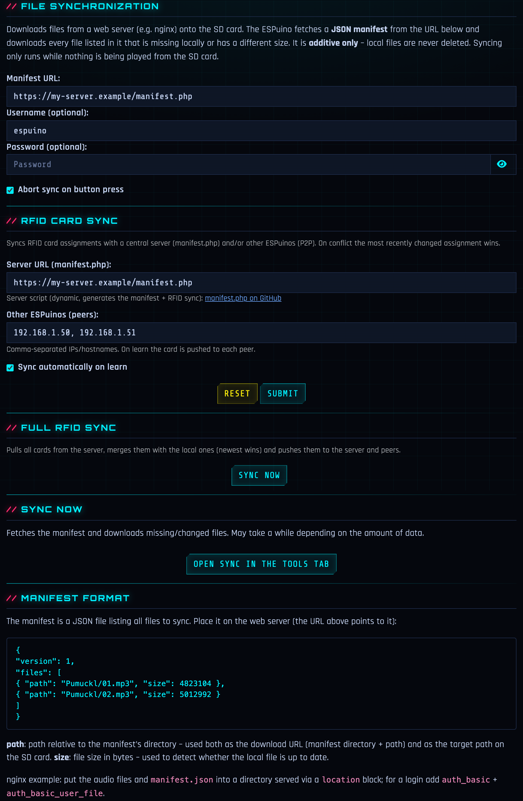

<div align="center">


# LEO INDUSTRIES AT-1

`// RFID AUDIO PLAYER :: ESP32 :: CYBERPUNK EDITION`

[-00f0ff?style=flat-square&labelColor=05070d)](https://github.com/biologist79/ESPuino)
[](LICENSE)
[](platformio.ini)

</div>

> **LEO INDUSTRIES AT-1** is a private fork of [ESPuino](https://github.com/biologist79/ESPuino)
> (branch `dev`) — an RFID-controlled audio player based on the ESP32. This fork gives the web
> interface a complete cyberpunk overhaul and adds a number of features around RFID detection,
> Bluetooth, backups and convenience. For the upstream hardware, wiring and general documentation
> please refer to the [original documentation](https://forum.espuino.de/c/dokumentation/anleitungen/10).
>
> ⚡ **Full disclosure:** the firmware and web interface in this fork are largely *vibe-coded*
> (AI-assisted). The hardware is not — the enclosure was designed by hand in CAD without any AI.
> The printable STL files live in [`stl/`](stl/).

---

# // HARDWARE

The physical build — a 3D-printed enclosure housing an ESP32, a PN5180 RFID reader, speaker and
battery. The case was modelled by hand in CAD (no AI involved); all printable parts — case,
panels, lids, handle, rotary knob, keycaps and the RFID cartridge — are available as STL files in
[`stl/`](stl/).

<div align="center">


<sub>The finished, 3D-printed AT-1 — front panel with the play controls and speaker, and the RFID “INSERT CARD” cartridge slot.</sub>

</div>

## Bill of materials

| Part | Details | Source |
| --- | --- | --- |
| Mainboard | ESPuino **complete** board (rev 5.1) | [forum.espuino.de](https://forum.espuino.de/t/espuino-complete/3817) |
| Headphone amplifier board | biologist79 **MS6324 + TDA1308 / LM4808M** board | [forum.espuino.de](https://forum.espuino.de/t/kopfhoererplatine-basierend-auf-ms6324-und-tda1308-bzw-lm4808m/1099) |
| Rotary-encoder board | **Drehencoder by ESPuino** | [forum.espuino.de](https://forum.espuino.de/t/drehencoder-by-espuino/2414) |
| RFID reader | NXP **PN5180** (JST 2.5 mm socket soldered on) | [AliExpress](https://de.aliexpress.com/item/1005006781712003.html) |
| RFID tags | one tag per cartridge | [Amazon](https://www.amazon.de/dp/B0CSJST6KZ) |
| Display | **OLED** 128×64, I2C (SH1106 / SSD1306) | [AliExpress](https://www.aliexpress.com/item/1005006862867338.html) |
| Speaker | **Peerless by Tymphany TC7FD00-04** | [SoundImports](https://www.soundimports.eu/de/peerless-by-tymphany-tc7fd00-04.html) |
| Battery | **LiFePO₄ 3.2 V 6000 mAh** pack with protection, JST-PH 2.0 | [eremit.de](https://www.eremit.de/p/3-2v-6000mah-pack-mit-schutz-arduino-aio-jst-ph-2-0-stecker) |
| Status LEDs | 2× **8-LED WS2812B** (NeoPixel) | [Amazon](https://www.amazon.de/dp/B09YTLY6CK) |
| Standby LED | **white breathing LED** | [AliExpress](https://de.aliexpress.com/item/1005005336879647.html) |
| Internal USB tap | adapter to tap USB off the complete board (**4-pin version**) | [AliExpress](https://de.aliexpress.com/item/1005009847773743.html) |
| External USB port | panel-mount socket that exposes an external USB port and passes the 4 USB lines through to the internal connector | [AliExpress](https://de.aliexpress.com/item/1005009015653966.html) |
| Power switch | latching switch | [AliExpress](https://de.aliexpress.com/item/4001099324784.html) |
| Key switches | **Kailh BOX Navy** (clicky) for the panel buttons | [whackydesks](https://whackydesks.com/produkt/kailh-box-navy/) |
| Magnets | 4× **10×3 mm** per cartridge | — |
| Screws | 50× button-head **ISO 7380 A2 M3×8**<br>25× thermoplastic self-tapping **2.5×10 TORX, black A2** | [screwsandmore](https://www.screwsandmore.de) |
| Sealing | Kafuter **K-704B** + **K-705**, transparent | — |

### Filament & finishing

- **[Extrudr XPETG Matt](https://www.extrudr.com/shop-eu/products/xpetg-matt/)** — Metallic and Black
- **[Extrudr PETG](https://www.extrudr.com/shop-eu/products/petg/)** — Turquoise and Copper
- **[Bambu Lab TPU 85A](https://us.store.bambulab.com/products/tpu-85a-tpu-90a)** — for the gaskets

Many of the JST/connector cables were hand-crimped with **ENGINEER PA-09** crimping pliers.

> 🚧 _Still to add: photos of the opened unit / internals and wiring/pinout notes._

---

# // SOFTWARE

The firmware is based on ESPuino's `dev` branch with a cyberpunk web interface and a set of
fork-specific features. The full interface (default RFID tab shown below, live from the device):

<div align="center">


</div>

## // Differences to upstream

All changes compared to upstream/`dev`, each with a reference to its commit.

### Web interface

The management and access point pages were completely rebuilt in a cyberpunk style — neon
palette, scanlines, `Orbitron`/`Rajdhani`/`Share Tech Mono` typography, a custom login page, the
upstream Bluetooth scan UI restyled to match, the device branding in the navbar and an embedded
neon logo that doubles as the SVG favicon ([`7be5254`](../../commit/7be5254)):

<div align="center"></div>

| Change | Commit |
| --- | --- |
| PWA support: web app manifest + app icon, "add to home screen" with proper icon and name | [`b4287b9`](../../commit/b4287b9) |
| PWA offline fallback: a service worker serves a cyberpunk "ESPuino Offline" page (with auto-reconnect) instead of a black screen when the home-screen app is launched while the player is powered off | [`bd07a7c`](../../commit/bd07a7c) |
| Full backup: export/import of all settings + RFID assignments as JSON, WiFi credentials optional | [`4c90ff4`](../../commit/4c90ff4) |
| One-click OTA update: GitHub Actions publishes a rolling `latest` release (`firmware.bin`); a Tools-tab button makes the device pull that firmware from GitHub over HTTPS and flash it via OTA, then reboot. Also triggerable via the bindable command **186** (button/RFID modifier) and the MQTT command-topic `firmware_update` (`ON`/`update`); the state-topic reports `idle`/`updating`/`up_to_date`/`failed` | [`8527f5e`](../../commit/8527f5e) |
| Equalizer profiles: dropdown presets (Flat / Music / Audiobook-Speech / Deep voices / Custom) on top of the 3-band tone control; speech presets cut bass and lift mids/highs so deep narrator voices stay intelligible, persisted in NVS. Profiles can also be assigned per file or directory (right-click in the file browser) — e.g. set the speech profile for all Bibi Blocksberg episodes at once; the RFID tab shows the active profile for the highlighted file (or "No EQ set"). The active profile can be cycled with the bindable command **154** (button/RFID modifier) and set/reported via the MQTT topic `equalizer` (`flat`/`music`/`speech`/`voiceBoost`) | [`11ade33`](../../commit/11ade33) |
| Blinking "OK" indicator next to the battery replaces the generic "action successful" toast | [`f41bb72`](../../commit/f41bb72) |
| Blinking "connection lost" icon in the navbar replaces the connection-lost toast | [`be13308`](../../commit/be13308) |
| WiFi signal-strength indicator in the navbar (RSSI %, color-coded), next to the battery | [`26e8cf8`](../../commit/26e8cf8) |
| Play/pause button in the RFID tab plays the highlighted file/folder (and pauses running playback) | [`3870bb7`](../../commit/3870bb7) |
| File browser tab renamed to "Files" (folder icon) and the file tree view height doubled for easier navigation | [`3af1fc2`](../../commit/3af1fc2) |
| Cyberpunk footer below the interface (neon "LEO INDUSTRIES // DIVISION: AUDIO" branding) | [`b49f131`](../../commit/b49f131) |
| SD card cleanup: removes macOS metadata (`.DS_Store`, `._*`, Spotlight/Trashes) with one click | [`4e68541`](../../commit/4e68541) |
| Live log: the log dialog refreshes every 2 s and follows the end of the log | [`5183e78`](../../commit/5183e78) |
| Drag & drop: upload files by dropping them from the file manager onto the file tree | [`f8b477b`](../../commit/f8b477b) |
| Password protection: single password (no username), 90-day session cookie, logout menu entry, brute-force lockout; inactive in hotspot mode. Scripts/API clients can authenticate by sending the password as an **API key** via the `X-API-Key` header or an `apikey` query parameter (e.g. `curl -H "X-API-Key: <pw>" …`) | [`e74e712`](../../commit/e74e712) |
| Log download as a text file | [`5d9d591`](../../commit/5d9d591) |
| Battery indicator in the navbar with a low-battery warning toast | [`4566ae0`](../../commit/4566ae0) |
| SD card capacity gauge in the files tab and the info dialog | [`45b340a`](../../commit/45b340a) |
| FTP server can be stopped from the web interface (start button turns into a stop button) | [`6ea4020`](../../commit/6ea4020) |
| FTP password shown in settings with a show/hide (eye) reveal toggle (already persisted in NVS) | [`df0a583`](../../commit/df0a583) |
| Bluetooth modes can be stopped from the web interface; commands 143/144 switch modes directly via buttons | [`f16030f`](../../commit/f16030f) |
| Button lock (Kindersicherung) toggle directly in the control tab of the web interface with visual lock status indicator | [`520815a`](../../commit/520815a) |
| Control buttons (single-track Repeat toggle, Sleep-Timer with dropdown and live remaining countdown, Night Mode/Dimming) directly in the control tab of the web interface | [`88a742c`](../../commit/88a742c) |
| Bluetooth-mode dropdown in the control tab (Normal / Speaker / Headphones), mirroring the sleep-timer dropdown; selecting a mode restarts the device into it and the button highlights the active BT mode | [`d57f24a`](../../commit/d57f24a) |
| Mobile-optimized control tab: the hard-to-drag volume slider is replaced by full-width louder/quieter (+ EQ) buttons on phones, and the control header stacks so the legend stays on one line with the action buttons below | [`aef1765`](../../commit/aef1765) |
| System-information dialog rendered as a clean property/value table (instead of preformatted text) and extended with the PN5180 RFID-reader firmware version (read once from the reader's EEPROM at init and exposed via `/info`) | [`715d867`](../../commit/715d867) |
| Rolling build version (`rN` from the commit count, embedded via `gitVersion.py` and published in the release `version.json`) shown as a navbar badge — green when the device runs the latest rolling release, amber when an update is available (passive `/version` check); clicking the amber badge starts the GitHub OTA; also listed in the info dialog | [`b736abc`](../../commit/b736abc) |
| Home Assistant **MQTT discovery**: on connect the device auto-registers all entities under one HA device — track/status/firmware/software/WiFi (+ battery) sensors, volume & LED-brightness numbers, lock & ambient-light switches, equalizer select, and transport/update/shutdown buttons | [`db73db1`](../../commit/db73db1) |
| Consolidated **Settings** tab (UniFi-style): WiFi, MQTT, FTP and Bluetooth settings merged with the general settings into one top tab with centered horizontal sub-tabs (General / Buttons / WiFi / MQTT / FTP / Bluetooth), the button-assignment config moved into its own **Buttons** sub-tab, plus an FTP start/stop button in the control tab; also fixes the sleep-timer dropdown staying open on outside-click and the desktop control-tab volume slider rendering at zero width | [`8b01876`](../../commit/8b01876) |
| Battery-backed **RTC** (DS3231): optional `RTC_ENABLE` adds a real-time clock on the external I²C bus so the time stays correct without WiFi/NTP. The RTC stores UTC and seeds the system clock at boot (before WiFi is up); NTP remains the master and disciplines the RTC on every sync and hourly. Current time (and DS3231 die-temperature) shown in the info dialog, published via the MQTT state-topic `rtc` (+ Home Assistant discovery), and the RTC can be re-disciplined from system time via the bindable command **155** (button/RFID modifier) | [`bf90f66`](../../commit/bf90f66) |
| **Status control-LEDs**: the optional control LEDs (`NUM_CONTROL_LEDS`, soldered to the end of the same NeoPixel data line — no extra GPIO) can now mirror a runtime state instead of just showing a static color. Each control LED gets a per-slot function in the LED settings — **Static** (legacy fixed color), **Key lock** (red while controls are locked), **Repeat mode** (green = track, blue = playlist, purple = both), **Bluetooth** (violet = waiting, blue = connected), **Battery level** (state of charge as a green→yellow→red gradient) or **Off**. A master switch mutes all control LEDs (e.g. at night), toggleable via the bindable command **121** (button/RFID modifier) and the MQTT command/state-topic `control_leds` (`ON`/`OFF`, + Home Assistant discovery switch) | [`d12a496`](../../commit/d12a496) |
| **HTTP file sync**: pull audio files from a web server (e.g. nginx) onto the SD card. A new **Sync** settings sub-tab takes a manifest URL plus optional HTTP Basic Auth (user/password); the device fetches a JSON manifest (`{"files":[{"path","size"},…]}`) and downloads every listed file that is missing locally or differs in size, streaming each in small chunks straight to SD. Additive only (never deletes), runs in a background task, and shows live progress including the file currently being downloaded plus a stop button to cancel a running sync. The **Sync** settings sub-tab holds the config (manifest URL + Basic Auth) and documents the manifest format/nginx setup; the actual run button and live progress live in the **Tools** tab, with a shortcut button in the Sync sub-tab that jumps there. If audio is playing when a sync starts, playback is paused for the SD-writing phase and resumes automatically when the sync finishes; pressing play (or skipping a track) cancels the running sync and resumes playback immediately. Any button press (or triggered command) also aborts a running sync — toggleable in the Sync settings sub-tab (default on). Reloading the web UI reconnects to a sync still running in the background instead of showing an idle state. A stalled download (connection open but no data for 20 s) is aborted and marked failed so one bad/slow file can't hang the whole sync. While a sync runs the NeoPixel indicator LEDs light solid blue (a single transmission while the LED task is paused, so there is no repeated refresh to starve WiFi/TLS). A running sync also keeps the device awake: since the sync runs in a background task and pauses playback, it no longer refreshes the activity timer on its own, so the inactivity timeout / sleep-timer is suppressed while a sync is in progress — preventing the device from going to deep-sleep mid-transfer (which would tear down the SD card and abort the sync); the timer resumes normally once the sync finishes | [`ac24bbc`](../../commit/ac24bbc) |
| **Fully offline web interface**: all third-party libraries (jQuery, jQuery-UI, Bootstrap JS/CSS, jstree + themes, bootstrap-slider, Font Awesome + webfonts, i18next) and the Orbitron/Rajdhani/Share Tech Mono fonts are now vendored and served gzipped from the device instead of public CDNs. This fixes the ~2-minute first-load hang with empty (untranslated) text after a cold boot/flash, and makes the management UI work without any internet access (incl. AP mode). `processHtml.py` embeds the assets into flash (build size grows accordingly) and now derives unique header symbol names from the full asset path. The libs are concatenated into a single JS and a single CSS bundle (`tools/bundle_assets.py`) so the page makes only a handful of requests — many parallel requests to the ESP32's async web server made some browsers (Safari/Chrome) stall for minutes while Firefox coped | [`c618191`](../../commit/c618191) |
| **M3U playlist builder**: a "Create playlist" button in the Files tab opens a two-pane builder — browse the SD card on the left, an ordered (drag-to-reorder) track list on the right — to assemble an `.m3u` from SD files, whole folders, and webradio URLs (which `LOCAL_M3U` plays interchangeably). Saving writes `/Playlists/<name>.m3u` via a new `POST /playlist` endpoint; the file can then be assigned to an RFID tag with play mode 11. i18n de/en/fr | [`af041fc`](../../commit/af041fc) |
| **File browser: assignment badges + context-menu RFID learn (scan-after-select)**: in the Files-tab tree each row is badged (right-aligned, after the name) when that exact path has an **RFID tag** assigned (tag icon) and/or a **per-path EQ rule** (sliders icon), so you can see at a glance what is mapped where. The explorer **context menu** learns/removes RFID assignments directly: right-click a file/folder → **RFID anlernen** → pick a play mode → a **popup** asks you to lay the card (scan or cancel) and the next scanned card is assigned to that path (no tab switch / submit); or **remove** an existing assignment. Mirrors the existing EQ-profile submenu. Works with physical cards and the [virtual cards](#virtual-rfid-cards) (`CMD_VIRTUAL_RFID_CARD_*`) alike. Badges refresh when a folder is (re)opened and live after assigning/removing. i18n de/en/fr | [`7b8e303`](../../commit/7b8e303) |
| **No standby while on external power**: optional setting (General tab) that keeps the device from entering the inactivity standby while it is on external power. The `complete` board has no charge/USB sense, so "on power" is inferred heuristically from the battery voltage against a configurable threshold (default **3.5 V** — the LiFePO4 charge voltage sits above its resting voltage). The manual sleep timer is unaffected. i18n de/en/fr | [`no-sleep-on-power`](../../releases/tag/no-sleep-on-power) |
| **Auto-save settings (General + Buttons)**: the **General** and **Buttons** settings sub-tabs no longer have a submit button — changes are persisted automatically (debounced ~0.6 s) as soon as you toggle/select or leave a field. Populating the form on load is suppressed so it never triggers a spurious save; the **Reset** button now applies the defaults right away. The credential/connection tabs (WiFi, security, MQTT, FTP, Bluetooth) keep their explicit submit button on purpose (half-typed passwords / reboot on Bluetooth-mode change). i18n de/en/fr | [`settings-autosave`](../../releases/tag/settings-autosave) |
| **RFID settings sub-tab + learned-cards list**: the old inline RFID-assignment form (id field + play-mode + submit) is gone — music cards are learned from the file-browser context menu (scan popup). A new **RFID** settings sub-tab learns **modification cards** (pick a modification action → **Learn card** → scan popup) and lists **all learned cards** (music = path + play mode, modification = action) with a delete button each. i18n de/en/fr | [`rfid-settings-tab`](../../releases/tag/rfid-settings-tab) |
| **Listening-time statistics**: tracks how long was actually listened per local calendar day in a 365-day ring buffer (persisted in NVS, ~1.5 KB). The info dialog (ℹ️) shows **today / yesterday / last 7 days / last 30 days** next to the existing total playtime. Seconds are accumulated by the audio loop while playing (clock from NTP/RTC; ignored until the clock is valid), flushed to NVS at most once a minute and on shutdown. New `/info` audio fields `playToday`/`playYesterday`/`play7d`/`play30d` (seconds). i18n de/en/fr | [`listening-stats`](../../releases/tag/listening-stats) |
| **RFID-tag syncing (server + peer-to-peer)**: keeps RFID-tag assignments in sync across a central PHP server *and* other ESPuinos at the same time. On **learn** a freshly assigned card is pushed to the server and to every configured peer; a **full sync** (button in the Sync settings tab, bindable command **187**, or MQTT `rfid_sync`) pulls the server list, merges newest-wins per tag id (by timestamp) and pushes every local tag back to server + peers. A **catch-up** sync runs automatically once after the device comes online, so a player used **offline/outdoors** (no WiFi, no server) keeps working — cards learned offline are stored locally and pushed up on reconnect (assignments made while the clock was never set are healed to "now" on first sync so they win). Conflict resolution is **newest-wins** by timestamp. Two dynamic server scripts (no static manifest.json): [`server/manifest.php`](server/manifest.php) lists the files for the file sync, [`server/rfid.php`](server/rfid.php) is the stateful RFID-tag store — both are linked from the Sync settings tab. Peers are managed in a small **add-peer editor** (IP/hostname + password, with a reveal toggle) and stored as JSON; since ESPuinos are password-protected, the peer push authenticates with each peer's password via the `X-API-Key` header (falling back to this device's web password). The Sync settings tab is split into **File sync** and **RFID-tag sync** sections (each Save button disabled until its URL is filled), and both runners (file sync + RFID full sync) live in the **Tools** tab. The file browser badges a file/folder (after the name) when it has an RFID assignment (tag icon) or a per-path EQ rule (sliders icon), and the explorer context menu can assign/remove both. i18n de/en/fr | [`rfid-sync`](../../releases/tag/rfid-sync) |
| **Configurable branding + RFID settings tidy-up**: the navbar **header** title and the **footer** brand are now configurable (General → Branding) with a **live preview** as you type — empty keeps the "Leo Industries" default, so the fork is easy to re-brand. The Sync settings tab is split into two clear sections (**File sync** and **RFID-tag sync**). The RFID **reader** settings (reader type, MFRC522 gain, PN5180 LPCD, SLIX2 password) moved out of the General tab into the **RFID** settings sub-tab where they belong, next to the card-learning UI. Both are covered by the General/RFID-tab auto-save. i18n de/en/fr | [`ui-branding`](../../releases/tag/ui-branding) |
| **Now-playing: ID3 artist + album**: the Control tab already showed the ID3 **title** and embedded **cover** (APIC); it now also parses the **artist** (`TPE1`/`ARTIST=`) and **album** (`TALB`/`ALBUM=`) tags and shows them as "Artist — Album" under the title. The fields are reset per track (so a tag-less track doesn't show stale metadata) and exposed in the `trackinfo` websocket payload (`artist`/`album`) | [`id3-meta`](../../releases/tag/id3-meta) |
| **OpenAPI/Swagger spec updated**: the bundled `REST_API.yaml` (served at `/swagger.html`) now documents all fork-added endpoints (`/sync`, `/syncstop`, `/playlist`, `/githubupdate`, `/version`, `/login`, `/logout`, `/security`, `/eqrule(s)`, `/activeequalizer`, `/bluetooth*`, `/sdclean`) and declares the security schemes (`X-API-Key` header / `apikey` query param, or the `ESPUINO_SESSION` login cookie) so the Swagger "Authorize" button works. The web-interface footer links to the Swagger UI (`/swagger.html`) | [`f8298d9`](../../commit/f8298d9) |

#### Feature highlights

**SD capacity gauge** — free / total space below the file browser ([`45b340a`](../../commit/45b340a)):

<div align="center"></div>

**Battery indicator** — live charge level in the navbar ([`4566ae0`](../../commit/4566ae0)):

<div align="center"></div>

**SD cleanup** — one click removes macOS metadata junk ([`4e68541`](../../commit/4e68541)):

<div align="center"></div>

**SLIX2 password** — read protected ICODE-SLIX2 tags ([`d3cc69c`](../../commit/d3cc69c)):

<div align="center"></div>

**Equalizer presets** — Flat / Music / Audiobook-Speech / Deep voices / Custom on top of a 3-band tone control ([`11ade33`](../../commit/11ade33)):

<div align="center"></div>

**Control buttons** — single-track Repeat, Sleep-Timer, Night Mode, FTP, Bluetooth and lock, directly in the control tab ([`88a742c`](../../commit/88a742c)):

<div align="center"></div>

**Bluetooth-mode dropdown** — switch Normal / Speaker / Headphones from the control tab (the active mode is hidden) ([`d57f24a`](../../commit/d57f24a)):

<div align="center"></div>

**Settings tab** — WiFi / MQTT / FTP / Bluetooth merged with the general settings into one tab with horizontal sub-tabs ([`8b01876`](../../commit/8b01876)):

<div align="center"></div>

**Buttons sub-tab** — short/long press and multi-button command assignments in their own settings sub-tab ([`8b01876`](../../commit/8b01876)):

<div align="center"></div>

**Playlist builder** — assemble an `.m3u` from SD files, whole folders and webradio URLs in a drag-to-reorder two-pane dialog ([`af041fc`](../../commit/af041fc)):

<div align="center"></div>

**HTTP file sync** — pull files from a web server (manifest URL + optional Basic Auth); the runner & live progress live in the Tools tab ([`ac24bbc`](../../commit/ac24bbc)):

<div align="center"></div>

**RFID-tag syncing** — keep tag assignments in sync across a central PHP server and other ESPuinos (P2P), newest-wins by timestamp, with offline catch-up ([`rfid-sync`](../../releases/tag/rfid-sync)):

<div align="center"></div>

**Learn RFID cards from the file browser** — right-click a file/folder → pick a play mode → a popup asks you to lay the card ([`7b8e303`](../../commit/7b8e303)):

<div align="center"></div>

**Listening-time statistics** — today / yesterday / last 7 / last 30 days in the info dialog ([`listening-stats`](../../releases/tag/listening-stats)):

<div align="center"></div>

**Configurable branding** — re-brand the header and footer; empty keeps the default ([`ui-branding`](../../releases/tag/ui-branding)):

<div align="center"></div>

### RFID & audio

| Change | Commit |
| --- | --- |
| Tag removal detected via consecutive-miss counter instead of a wall-clock timeout: pause after ~0.5 s, immune to phantom dropouts and task starvation | [`1fad9cd`](../../commit/1fad9cd) |
| Vendored PN5180 library with fast no-card detection: read attempts on an empty field take ~25 ms instead of ~230 ms (no more 200 ms timeout) | [`8762784`](../../commit/8762784) |
| SLIX2 password support for protected ICODE-SLIX2 tags | [`d3cc69c`](../../commit/d3cc69c) |
| Configurable idle LED and progress bar colors | [`bdc54e5`](../../commit/bdc54e5) |
| Ready sound on cold start | [`c051c40`](../../commit/c051c40) |
| Cyberpunk "Data Drop" idle LED animation | [`f20b111`](../../commit/f20b111) |
| Selectable idle animation (standard idle dots or cyberpunk "Data Drop") in the LED settings; defaults to standard | [`f6c3f4e`](../../commit/f6c3f4e) |
| Improved button responsiveness and track navigation seek options | [`76e1535`](../../commit/76e1535) |
| Unlocking controls via button press while locked | [`d83e15f`](../../commit/d83e15f) |
| Support for a 6th button | [`b116151`](../../commit/b116151) |
| OLED display support (SH1106/SSD1306 128×64 over I2C): boot splash, idle screen with IP + READY, now-playing title (up to 3 lines, scrolling) with battery/time/wifi status bar, and a volume bar | [`8ce8104`](../../commit/8ce8104) |

### Virtual RFID cards

This is an existing ESPuino feature (not a fork addition) that is easy to miss, so it is documented
here for clarity. Action-to-button assignment in general works as described in the upstream
*"dynamic button layout"* documentation.

**Normal card.** A physical RFID card has a fixed, pre-programmed number. When the card is placed on
the reader the ESP32 reads that number (it is also pushed into the web interface). You then *learn*
the card — i.e. you link its number to an action. The next time the card is placed, the ESP32 looks
up that mapping in its flash and runs the matching action.

**Virtual card.** You bind a button press (short or long) or a two-button combination to an action
in `settings.h` as usual — but the actions `CMD_VIRTUAL_RFID_CARD_01` … `CMD_VIRTUAL_RFID_CARD_10`
are special: they *simulate placing a card*. Running `CMD_VIRTUAL_RFID_CARD_01` is exactly the same
as placing a physical card with the number `900000000001` (…`_10` → `900000000010`). You learn that
number in the web interface like any normal card, and pressing the bound button then has the same
effect as placing that card. The fixed ids live in [`src/values.h`](src/values.h) and are enqueued
in [`src/Cmd.cpp`](src/Cmd.cpp). MQTT can lay the same ids via the `rfid` command topic.

> Tip: to learn a (physical or virtual) card to a file/folder, right-click it in the file browser →
> **RFID anlernen** → pick a play mode, then lay the card (or press the button bound to its virtual id).

## // Flashing

```bash
pio run -e complete -t upload
```

The web interface (HTML, locales, manifest, icons) is embedded into the firmware automatically
during the build. Alternatively use OTA: Tools → firmware update with
`.pio/build/complete/firmware.bin`.

This fork is developed and shipped on the **complete** board, but the upstream ESPuino board
environments are kept in `platformio.ini` for anyone running different hardware:
`lolin_d32_pro`, `lolin_d32_pro_sdmmc_pe`, `ttgo_t8`, `esp32-wrover-devkitc-v4-8mb` and
`esp32-s3-devkitc-1` (e.g. `pio run -e ttgo_t8 -t upload`). Only `complete` is built in CI.

## // Upstream sync

The fork follows upstream/`dev`. The remote is already set up:

```bash
git fetch upstream
git rebase upstream/dev
```

## // License

Same as the original: [GPL-3.0](LICENSE). The original README content (hardware, HALs, wiring)
can be found in the [ESPuino documentation](https://github.com/biologist79/ESPuino#readme).
