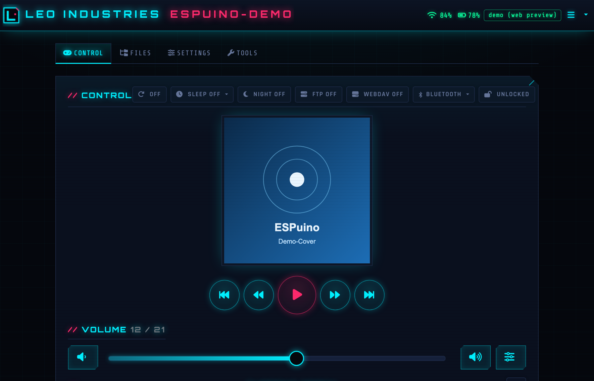
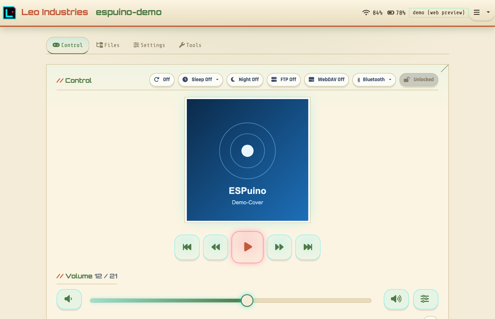
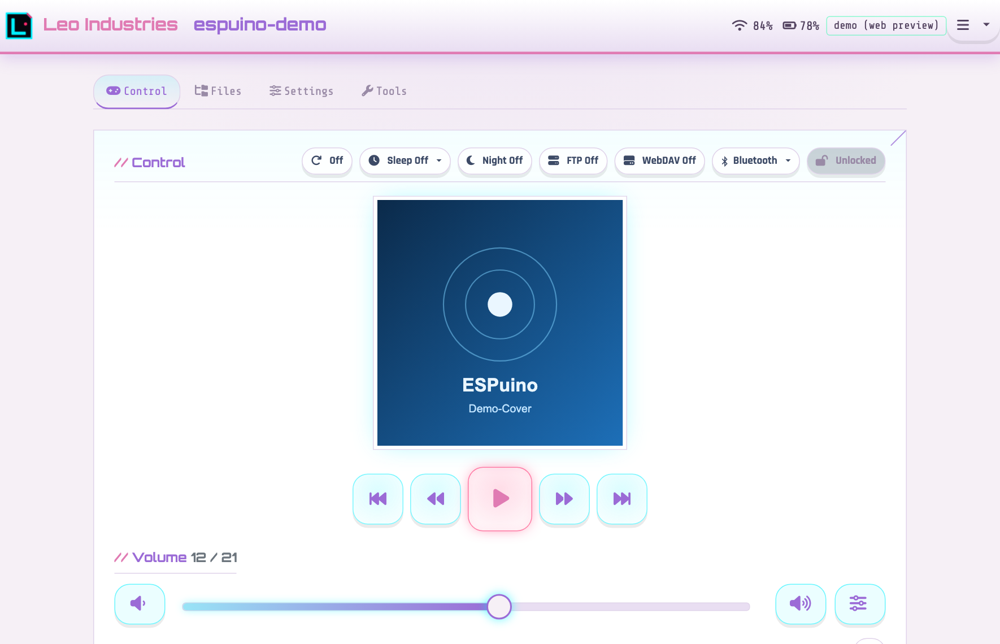
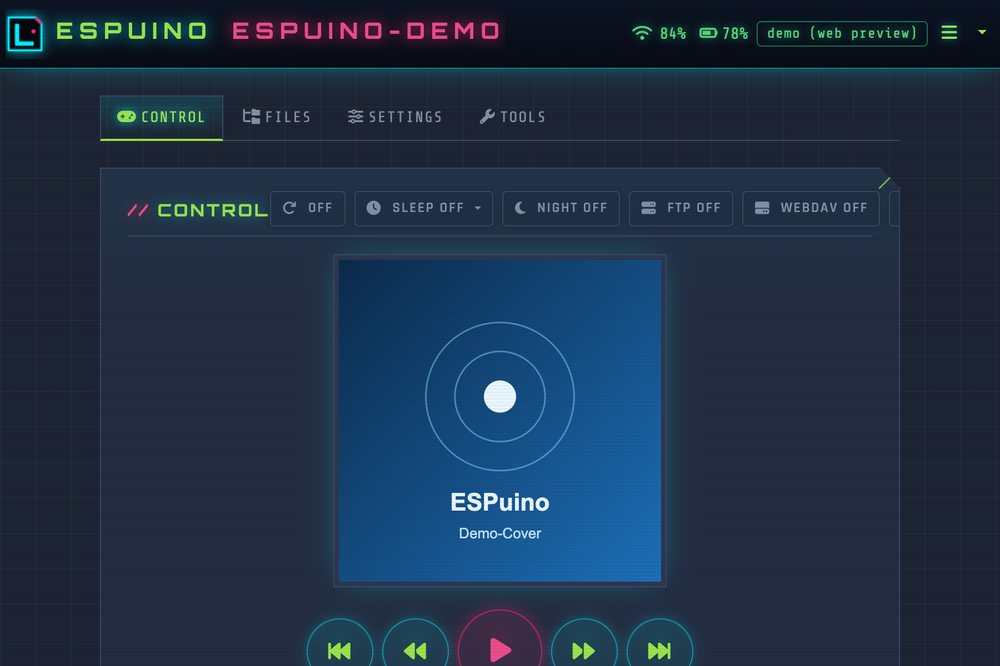
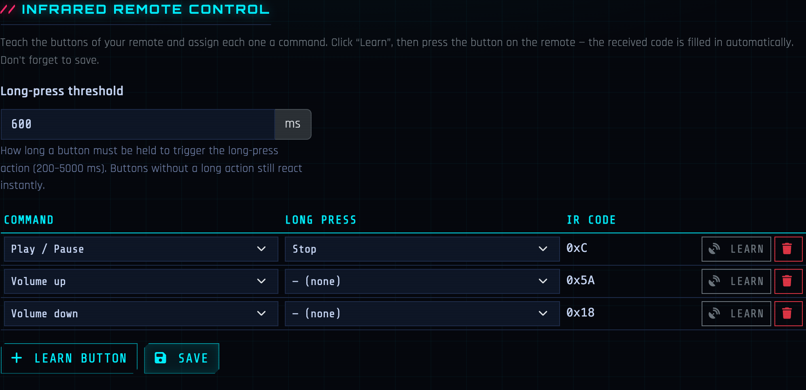
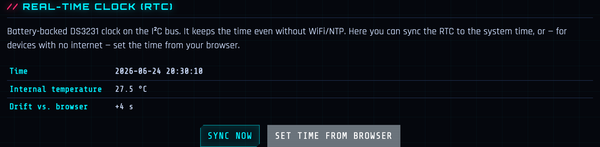

<div align="center">


# LEO INDUSTRIES AT-1

`// RFID AUDIO PLAYER :: ESP32 :: CYBERPUNK EDITION`

[-0e7490?style=flat-square&labelColor=05070d)](https://github.com/biologist79/ESPuino)
[](LICENSE)
[](platformio.ini)

<a href="https://fhirschmann.github.io/leoino/"></a>

</div>

> **LEO INDUSTRIES AT-1** is a private fork of [ESPuino](https://github.com/biologist79/ESPuino)
> (branch `dev`) — an RFID-controlled audio player based on the ESP32. This fork gives the web
> interface a complete cyberpunk overhaul and adds a number of features around RFID detection,
> Bluetooth, backups and convenience. For the upstream hardware, wiring and general documentation
> please refer to the [original documentation](https://forum.espuino.de/c/dokumentation/anleitungen/10).
>
> ⚡ **Full disclosure:** the firmware and web interface in this fork are largely *vibe-coded*
> (AI-assisted). The hardware is not — the enclosure was designed by hand in CAD without any AI.
> The printable STL files live in [`stl/`](stl/).

---

# // HIGHLIGHTS

The fork-specific features that stand out most against stock ESPuino. The complete,
commit-by-commit list lives further down under
**[Differences to upstream](#-differences-to-upstream)**.

- 🎨 **Cyberpunk web interface, four switchable themes** — management + access-point pages
  fully rebuilt in neon; pick between **Cyberpunk** and three kid-friendly looks
  (**Waldhaus**, **Wölkchen**, **Pixelheld**), remembered per browser. A **settings search**
  box filters every option across all sub-tabs and jumps straight to the matching control.
- ⚡ **Fully offline & installable** — all libs and fonts vendored and served gzipped from
  flash, so the UI loads fast and works without internet (incl. AP mode); installable as a PWA.
- ▶️ **Try it with no hardware** — a [live browser demo](https://fhirschmann.github.io/leoino/)
  of the real management page on GitHub Pages, auto-deployed on every push.
- 📺 **OLED display** — optional 128×64 SH1106/SSD1306 screen: boot splash, idle screen with
  IP + clock, scrolling now-playing title with a battery/time/WiFi status bar and volume bar;
  deeply web-configurable — brightness, invert, idle clock (12/24h), auto-off + pixel-shift
  burn-in protection, custom login splash (username/boot-text/password-length/speed), track
  number, remaining-vs-elapsed time, inverted status bar, 180° flip, and the startup animation
  (optionally only on a real power-on, not on every sleep-wake).
- 🔒 **Password protection** — one shared password for the web UI, FTP *and* WebDAV (also
  usable as an `X-API-Key`), with a session cookie and brute-force lockout.
- 🔄 **HTTP file sync** — pull audio onto the SD card from a manifest, with opt-in **mirror
  mode** and a **dry-run** preview.
- 🆔 **RFID-tag syncing** — keep card→content assignments in sync across a central server *and*
  other ESPuinos (newest-wins, deletions propagate, offline catch-up).
- 📇 **Learn cards from the file browser** — right-click a file/folder → pick a play mode →
  scan; plus 10 virtual cards triggerable by button or MQTT.
- 🎚️ **Equalizer presets** — Flat / Music / Audiobook-Speech / Deep-voices / Custom on a
  3-band tone control, assignable per file or folder.
- 📖 **Audiobook resume hardening** — ~30 s checkpointing, smart in-file seek, fade-in on
  resume, restart-after-N-days and don't-resume-if-barely-started.
- 😴 **Gentle sleep fade** — the sleep timer can fade the volume down to silence over its
  final seconds instead of cutting off abruptly (web-configurable, 0 = off).
- ⏳ **Daily listening limit (screentime)** — cap how long the player may be used per day;
  once today's limit is reached playback stops and won't restart until the next day, with the
  usage shown in the info dialog and published to MQTT / Home Assistant.
- 🎵 **Now-playing metadata & stats** — ID3 title/artist/album + cover art, plus per-day
  listening statistics with a 30-day chart and CSV export.
- 💾 **Backup & restore** — export/import all settings + RFID + EQ rules + stats as one JSON,
  with optional automatic daily upload to a server.
- 🏠 **Home Assistant & 🍎 Apple HomeKit** — full MQTT auto-discovery and HomeKit/Siri pairing
  straight into the Home app.
- 📡 **Infrared remote with learn dialog** — teach every button of any IR remote straight from
  the IR settings tab; each button carries a short tap *and* a long-press action (configurable
  threshold), bound to the full command set and carried through backup/restore.
- 📟 **More hardware** — battery-backed RTC (DS3231), a 6th button and state-driven control LEDs.

---

# // HARDWARE

The physical build — a 3D-printed enclosure housing an ESP32, a PN5180 RFID reader, speaker and
battery. The case was modelled by hand in CAD (no AI involved); all printable parts — case,
panels, lids, handle, rotary knob, keycaps and the RFID cartridge — are available as STL files in
[`stl/`](stl/).

<div align="center">


<sub>The finished, 3D-printed AT-1 — front panel with the play controls and speaker, and the RFID “INSERT CARD” cartridge slot.</sub>

</div>

## Bill of materials

| Part | Details | Source |
| --- | --- | --- |
| Mainboard | ESPuino **complete** board (rev 5.1) | [forum.espuino.de](https://forum.espuino.de/t/espuino-complete/3817) |
| Headphone amplifier board | biologist79 **MS6324 + TDA1308 / LM4808M** board | [forum.espuino.de](https://forum.espuino.de/t/kopfhoererplatine-basierend-auf-ms6324-und-tda1308-bzw-lm4808m/1099) |
| Rotary-encoder board | **Drehencoder by ESPuino** | [forum.espuino.de](https://forum.espuino.de/t/drehencoder-by-espuino/2414) |
| RFID reader | NXP **PN5180** (JST 2.5 mm socket soldered on) | [AliExpress](https://de.aliexpress.com/item/1005006781712003.html) |
| RFID tags | one tag per cartridge | [Amazon](https://www.amazon.de/dp/B0CSJST6KZ) |
| Display | **OLED** 128×64, I2C (SH1106 / SSD1306) | [AliExpress](https://www.aliexpress.com/item/1005006862867338.html) |
| Speaker | **Peerless by Tymphany TC7FD00-04** | [SoundImports](https://www.soundimports.eu/de/peerless-by-tymphany-tc7fd00-04.html) |
| Battery | **LiFePO₄ 3.2 V 6000 mAh** pack with protection, JST-PH 2.0 | [eremit.de](https://www.eremit.de/p/3-2v-6000mah-pack-mit-schutz-arduino-aio-jst-ph-2-0-stecker) |
| Status LEDs | 2× **8-LED WS2812B** (NeoPixel) | [Amazon](https://www.amazon.de/dp/B09YTLY6CK) |
| Standby LED | **white breathing LED** | [AliExpress](https://de.aliexpress.com/item/1005005336879647.html) |
| Internal USB tap | adapter to tap USB off the complete board (**4-pin version**) | [AliExpress](https://de.aliexpress.com/item/1005009847773743.html) |
| External USB port | panel-mount socket that exposes an external USB port and passes the 4 USB lines through to the internal connector | [AliExpress](https://de.aliexpress.com/item/1005009015653966.html) |
| Power switch | latching switch | [AliExpress](https://de.aliexpress.com/item/4001099324784.html) |
| Key switches | **Kailh BOX Navy** (clicky) for the panel buttons | [whackydesks](https://whackydesks.com/produkt/kailh-box-navy/) |
| Magnets | 4× **10×3 mm** per cartridge | — |
| Screws | 50× button-head **ISO 7380 A2 M3×8**<br>25× thermoplastic self-tapping **2.5×10 TORX, black A2** | [screwsandmore](https://www.screwsandmore.de) |
| Sealing | Kafuter **K-704B** + **K-705**, transparent | — |

### Filament & finishing

- **[Extrudr XPETG Matt](https://www.extrudr.com/shop-eu/products/xpetg-matt/)** — Metallic and Black
- **[Extrudr PETG](https://www.extrudr.com/shop-eu/products/petg/)** — Turquoise and Copper
- **[Bambu Lab TPU 85A](https://us.store.bambulab.com/products/tpu-85a-tpu-90a)** — for the gaskets

Many of the JST/connector cables were hand-crimped with **ENGINEER PA-09** crimping pliers.

> 🚧 _Still to add: photos of the opened unit / internals and wiring/pinout notes._

---

# // SOFTWARE

The firmware is based on ESPuino's `dev` branch with a cyberpunk web interface and a set of
fork-specific features. The full interface (default RFID tab shown below, live from the device):

<div align="center">


</div>

### // Live demo

Try the web interface in your browser — **no hardware required**:

<div align="center">

<a href="https://fhirschmann.github.io/leoino/"></a>

<sub>↗ opens <strong>fhirschmann.github.io/leoino</strong></sub>

</div>

It is the real management page with a small mock layer that fakes the WebSocket and every
REST endpoint, filled with copyright-free content (public-domain fairy tales and classical
works). Every screen is clickable; write actions (save, restart, …) are no-ops. The demo is
rebuilt and redeployed automatically on every push by
[`build_demo.py`](tools/build_demo.py) → GitHub Pages, so it never goes stale. To build it
locally:

```bash
python3 tools/build_demo.py demo_dist
python3 -m http.server --directory demo_dist 8000   # open http://localhost:8000/
```

### // Themes

Four selectable themes (menu → 🎨) — each a pure client-side swap of the colour palette plus a
shape/typography "family", remembered per browser. **Cyberpunk** is the default (and the only one
with a dark/light toggle); the three kid-friendly designs each pin their own mood:

<table>
<tr>
<td align="center" width="50%"><br><sub><strong>Cyberpunk</strong> — neon noir, sharp &amp; glowing</sub></td>
<td align="center" width="50%"><br><sub><strong>Waldhaus</strong> — cosy cream &amp; forest, rounded</sub></td>
</tr>
<tr>
<td align="center" width="50%"><br><sub><strong>Wölkchen</strong> — soft marshmallow pastel</sub></td>
<td align="center" width="50%"><br><sub><strong>Pixelheld</strong> — dark 8-bit retro, square &amp; mono</sub></td>
</tr>
</table>

## // Differences to upstream

All changes compared to upstream/`dev`, each with a reference to its commit.

### Web interface

The management and access point pages were completely rebuilt in a cyberpunk style — neon
palette, scanlines, `Orbitron`/`Rajdhani`/`Share Tech Mono` typography, a custom login page, the
upstream Bluetooth scan UI restyled to match, the device branding in the navbar and an embedded
neon logo that doubles as the SVG favicon ([`7be5254`](../../commit/7be5254)):

<div align="center"></div>

| Change | Commit |
| --- | --- |
| **Cyberpunk web interface**: the management + access-point pages rebuilt with a neon palette, scanlines, `Orbitron`/`Rajdhani`/`Share Tech Mono` type, a custom login page, navbar branding, an SVG-favicon logo and a matching footer; the upstream Bluetooth scan UI restyled to fit | [`7be5254`](../../commit/7be5254) · [`b49f131`](../../commit/b49f131) |
| **Selectable UI themes** (menu → 🎨): switch the whole interface between the default **Cyberpunk** look and three kid-friendly designs — **Waldhaus** (cosy cream/forest, rounded), **Wölkchen** (soft marshmallow pastel) and **Pixelheld** (dark 8-bit retro: squared corners, monospace, lime/pink). Each theme carries its own shape/typography "family" (neon / playful / pixel) and pins its colour mode (Cyberpunk stays dark/light-togglable, the bright ones pin light, Pixelheld pins dark). Themes are a pure client-side CSS-variable + family swap (zero extra load on the ESP32 — the device still serves one static page) and the choice is remembered per browser in `localStorage` | [`6bb0097`](../../commit/6bb0097) · [`32a4d9b`](../../commit/32a4d9b) |
| **Fully offline web interface**: all third-party libs + fonts are vendored and served gzipped from flash (one JS + one CSS bundle), so the UI loads fast and works without internet (incl. AP mode) — fixes the ~2-min first-load hang and the browser stalls caused by too many parallel requests to the ESP32 | [`c618191`](../../commit/c618191) |
| **PWA**: installable web-app manifest + icon ("add to home screen"), plus an offline fallback page with auto-reconnect when launched while the player is powered off | [`b4287b9`](../../commit/b4287b9) · [`bd07a7c`](../../commit/bd07a7c) |
| **Browser demo on GitHub Pages** ([live](https://fhirschmann.github.io/leoino/)): a device-free static build of the management page with a mock WebSocket/REST layer and copyright-free content, auto-deployed on every push so the UI can be tried without hardware. A CI check (`tools/check_demo_endpoints.py`) fails the build if a new firmware HTTP endpoint is added without a matching demo-mock handler (or an explicit allow-list entry), so the demo can't silently break | [`8bf93da`](../../commit/8bf93da) |
| **Consolidated, auto-saving Settings tab**: WiFi/MQTT/FTP/Bluetooth merged with the general settings into one tab; the sub-tabs are a **vertical UniFi-style sidebar** (icon-only on mobile; stays pinned while scrolling) with flat, consistent sections, split into General / **Buttons** / **LEDs** / **Power** / **RFID** / … . General/Buttons/LEDs/Power/RFID auto-save (debounced); the credential tabs keep an explicit submit on purpose | [`8b01876`](../../commit/8b01876) · [`1944cf4`](../../commit/1944cf4) · [`c284d0e`](../../commit/c284d0e) · [`32aabfd`](../../commit/32aabfd) |
| **Configurable branding**: re-brand the navbar header *and* footer from a single **Brand name** field (General → Branding) with a live preview as you type — empty keeps the "Leo Industries" default, so the fork is easy to re-brand | [`fd57fcb`](../../commit/fd57fcb) |
| **Tools tab as a left-nav sidebar**: the Tools tab now uses the same **vertical UniFi-style sidebar** as Settings — Command / File sync / RFID sync / NVS / EQ rules / Backup / Firmware are individual sub-panes (icon-only on mobile, pinned while scrolling) instead of one long stacked scroll | [`dd3b4d7`](../../commit/dd3b4d7) |
| **Password protection**: single password (no username), 90-day `HttpOnly` session cookie, brute-force lockout, logout entry; off in hotspot mode. Scripts/API clients authenticate with the password as an **API key** (`X-API-Key` header) | [`e74e712`](../../commit/e74e712) |
| **One shared device password (Security tab)**: the password fields were pulled out of the WiFi/FTP/WebDAV tabs into a single **Security** sub-tab — one password now protects the web interface, FTP *and* WebDAV (set once, applies everywhere; applied live without a reboot). The password field is **write-only**: the device no longer echoes the stored password back (it is the shared web/FTP/WebDAV credential, so returning it turned any authenticated read into a credential leak) — leave the field empty to keep the current password, and tick the explicit **"Disable password protection"** switch to turn it off everywhere. The **hostname** moved to the top of the **General** tab (saved on its own; `/wificonfig` now does partial updates) and the navbar brand reads just **Leo Industries** | [`c6dfc67`](../../commit/c6dfc67) · [`5703fd2`](../../commit/5703fd2) |
| **FTP/WebDAV accept any username**: with one shared password the username is pointless, so both servers now authenticate by **password only — any username is accepted** (wrong password still rejected; empty device password = open). The username fields are gone from both tabs. FTP uses a **vendored, patched copy** of ESP-FTP-Server-Lib in [`lib/`](lib/ESP-FTP-Server-Lib) (password-only auth); WebDAV's self-contained server decodes the HTTP-Basic header and compares only the password | [`be96850`](../../commit/be96850) |
| **FTP auto-start on boot**: a toggle in the FTP tab starts the FTP server automatically once WiFi is up after boot (same one-shot pattern as WebDAV), so it no longer has to be enabled by hand each time | [`3abdfe5`](../../commit/3abdfe5) |
| **Configurable session-cookie lifetime**: the Security tab lets you set how long the web-interface login is remembered (in days) or choose **unlimited** (≈10 years; browsers cap cookies at ~400 days). Replaces the hard-coded 90-day cookie | [`3abdfe5`](../../commit/3abdfe5) |
| **One-click OTA + version badge**: a Tools-tab button (also bindable command **186** / MQTT `firmware_update`) pulls the rolling `latest` GitHub release and flashes it over OTA; a navbar badge shows the running build and turns amber when an update is available (passive `/version` check) — click it to install | [`8527f5e`](../../commit/8527f5e) · [`b736abc`](../../commit/b736abc) |
| **HTTP file sync**: pull audio files from a web server onto the SD card from a JSON manifest — additive by default (with an optional **mirror mode**, see below), streamed in chunks straight to SD, background task with live progress + stop, abort-on-button, stall watchdog, auto-pauses playback and keeps the device awake mid-transfer. The manifest is buffered to SD and parsed **one entry at a time**, so a large manifest (1000+ files) fits in the ESP32's limited heap and a `Transfer-Encoding: chunked` manifest (e.g. PHP-generated) is decoded correctly instead of failing to parse | [`ac24bbc`](../../commit/ac24bbc) · [`42d2c46`](../../commit/42d2c46) |
| **File-sync mirror mode** (opt-in): after the download pass, delete local files the manifest no longer lists, so the SD card becomes an exact mirror of the server folder. Hidden/system files, the **`/System` and `/Playlists` folders** (and everything inside them), and the firmware's own root files (`manifest.json`, `stats.csv`, `backup.txt`) are always kept, now-empty folders are pruned, and the delete pass only runs when the manifest loaded completely (a failed or empty manifest can never wipe the card). `/System` is moreover excluded from the **download** pass too, so a manifest can never write into it either. The set of manifest paths is held as 64-bit hashes in PSRAM so even a 1000+ file mirror costs almost no internal heap. Toggle it with **"Delete local files not in the manifest"** in the Sync settings tab (off by default) | |
| **File-sync dry run**: a **Dry run** button next to *Sync now* (Tools → File sync) previews exactly what a sync would do — every file it would download (`DL new`/`DL chg`) and, with mirror mode on, every file it would delete (`RM`) — **without changing anything**. The report is written to the SD card and shown in the web UI; especially useful to review a mirror-delete before committing to it. Exposed as `POST /sync?dry=1` + `GET /syncreport` | |
| **WebDAV server**: mount the SD card as a network drive (`http://<ip>:81/`) to copy audio on/off it straight from Finder/Explorer — no FTP client needed. Self-contained server (OPTIONS/PROPFIND/GET/HEAD+ranges/PUT/DELETE/MKCOL/MOVE/COPY/LOCK) running in its own task pinned to core 0 so transfers never disturb the audio pipeline; optional HTTP-Basic credentials. Configure + auto-start on boot in its own **WebDAV** settings sub-tab; start/stop live from the Control tab, command **188** or MQTT `webdav` (Home Assistant switch included). With auto-start on, the share is announced over **Bonjour/mDNS** (`_webdav._tcp`, `path=/`) so it pops up by itself in the Finder/Explorer network sidebar — no manual "Connect to Server" needed (currently disabled — see `WEBDAV_ENABLE`) | [`9b2bee0`](../../commit/9b2bee0) |
| **RFID-tag syncing (central server + peer-to-peer)**: keep tag assignments in sync across a PHP server *and* other ESPuinos — newest-wins by timestamp, deletions propagate via tombstones, automatic catch-up after coming online so a player used offline/outdoors keeps working. Run from the Tools tab, command **187** or MQTT `rfid_sync` | [`99ffb5b`](../../commit/99ffb5b) |
| **Equalizer profiles**: Flat / Music / Audiobook-Speech / Deep-voices / Custom presets on the 3-band tone control (speech presets keep deep narrator voices intelligible); assignable per file/folder, cycle via command **154** / MQTT `equalizer`. An over-full per-path rule set is now rejected with a clear error instead of silently failing | [`11ade33`](../../commit/11ade33) · [`addff5c`](../../commit/addff5c) |
| **Audiobook resume hardening**: the play-position is checkpointed to flash every ~30 s while playing, so a dead-battery / hard power-off only loses a few seconds instead of the whole track; the learned-cards list shows each tag's resume point with a restart-from-start button | [`a9f498f`](../../commit/a9f498f) |
| **Gentle sleep-timer fade-out**: instead of cutting playback off abruptly when the sleep timer expires, the volume is faded down to silence over the last *N* seconds. Only the audible gain is ramped (the stored/reported volume is untouched, so cancelling or extending the timer restores it); reuses the existing audiobook resume fade mechanism. Configured in **Settings → General → options** (*"Fade out before sleep timer (sec.)"*, NVS key `sleepFadeSec`, default 0 = off, hard stop as before) and applied live without a reboot | |
| **Daily listening limit (screentime)**: a maximum listening time per calendar day, set in **Settings → General → options** (*"Daily listening limit (min.)"*, NVS key `dailyLimitMin`, 0 = off). Once today's accumulated listening time reaches the limit, playback stops and applying a new card/playlist is refused until the next day (the audiobook position is kept, so it resumes tomorrow). Reuses the existing per-day listening-time ring buffer and is only enforced while the system clock is valid (NTP/RTC), so a device without a trustworthy date never locks out. The info dialog shows *today / limit*, and today's minutes + a *limit-reached* flag are published to MQTT with Home Assistant auto-discovery (`listened_today` sensor, `daily_limit_reached` binary sensor) | |
| **M3U playlist builder & editor**: a two-pane, drag-to-reorder builder (SD files, whole folders, webradio URLs) writes `/Playlists/<name>.m3u`; assign it to a card with play mode 11. **Existing playlists can be re-opened and edited** straight from the file-browser context menu (right-click an `.m3u` → *Edit playlist*): the builder reloads the current tracks, you reorder/add/remove, and *Save* writes it back — renaming it in the name field moves the playlist (the old file is removed). Reuses the existing `POST /playlist` + `GET /explorerdownload` endpoints, so no new firmware route | [`af041fc`](../../commit/af041fc) |
| **Learn RFID cards from the file browser**: right-click a file/folder → pick a play mode → scan popup; tree rows are badged when they have an RFID assignment or per-path EQ rule. When a card is **already assigned**, the same context menu lets you **switch its play mode in place** (e.g. single track → audiobook) without laying the card on the reader again — the current mode is ticked, and *Learn another card* keeps the scan flow available. A dedicated **RFID** settings sub-tab learns **modification cards**, lists all learned cards, and holds the reader settings (type, gain, LPCD, SLIX2 password) | [`7b8e303`](../../commit/7b8e303) · [`03c7b5a`](../../commit/03c7b5a) |
| **Now-playing metadata**: parses ID3 title/artist/album + embedded cover (with a folder `cover.jpg`/`folder.jpg` fallback); an info dialog shows the full detail (codec / sample-rate / bitrate / channels, path, play mode, RFID tag) via `GET /currenttrack`; artist/album are also published to MQTT + Home Assistant | [`ce3116c`](../../commit/ce3116c) · [`fda14a3`](../../commit/fda14a3) · [`4123db6`](../../commit/4123db6) · [`5cb0b8b`](../../commit/5cb0b8b) |
| **Listening statistics**: per-day listening time (today / yesterday / 7 d / 30 d) in a 365-day NVS ring buffer, plus a most-played-cards top list — shown in the info dialog (`GET /info`, `GET /topcards`). The info dialog also draws a **30-day bar chart** (inline SVG, themed, no chart lib) and offers a **CSV export** of the full daily series (`GET /stats.csv`, `date,seconds`) | [`af6c8d3`](../../commit/af6c8d3) · [`c2e7d44`](../../commit/c2e7d44) |
| **Full backup**: export/import all settings + RFID assignments + per-path EQ rules + listening stats + IR remote button mappings as one JSON file; passwords are only included when explicitly ticked, so a shared backup doesn't leak credentials | [`4c90ff4`](../../commit/4c90ff4) · [`646ec5c`](../../commit/646ec5c) |
| **Auto-backup to the sync server**: upload that same full backup (settings + RFID assignments + EQ rules + listening stats, **never** passwords) to a server straight from the device — no browser needed. A **Backup** section in the Sync settings tab takes the server URL (reusing the file-sync credentials) and a **once-a-day automatic** toggle; the file is streamed to SD entry-by-entry first (so a large RFID list fits in the limited heap) and then POSTed to the server, where the companion [`server/backup.php`](server/backup.php) stores it per-device and prunes old ones. The stored JSON drops straight back into the web interface's *import backup*. Run it from the Sync tab, command **189** or MQTT `backup` (Home Assistant button + status sensor included) | [`9763436`](../../commit/9763436) |
| **Home Assistant MQTT discovery**: auto-registers all entities under one HA device — track/status/firmware/WiFi/battery sensors, volume & LED-brightness numbers, lock & ambient-light switches, equalizer select, transport/update/shutdown buttons | [`db73db1`](../../commit/db73db1) |
| **Apple HomeKit + Siri** (`HOMEKIT_ENABLE`, via [HomeSpan](https://github.com/HomeSpan/HomeSpan)): pair the player straight into the Home app as a bridge with named tiles — **Playback** (play/pause + battery), **Volume** (brightness dimmer) and **Button-lock** — all controllable by Siri and usable in automations. State is mirrored back, so changes from buttons/RFID show up on the iPhone. Each device generates its **own random pairing code** on first boot (persisted in NVS) instead of a shared hard-coded one, so multiple ESPuinos — and everyone running this firmware — stay distinct and private. A dedicated **HomeKit settings section** shows the scannable pairing **QR code** + that setup code, a "reset pairing" button and an **on/off switch** to disable HomeKit entirely (HomeSpan then never starts, so it costs nothing at boot). HomeSpan now also comes up **lazily after boot** instead of inside `setup()` — and is held back until WiFi/mDNS have settled — so its multi-second start-up neither stalls the boot LED nor races ESPuino's own mDNS announce into an out-of-memory reboot loop (which otherwise surfaced once IR was enabled on the complete board). Pairs over the existing WiFi (no MFi chip needed); the HAP server runs on its own port and the poll task is pinned to core 0 so it never disturbs the audio pipeline on core 1 | [`6387563`](../../commit/6387563) |
| **Control tab**: Repeat / Sleep-Timer (live countdown) / Night-Mode / button-lock / FTP start-stop and a Bluetooth-mode picker (Normal / Speaker / Headphones) right in the control tab; mobile-optimised (full-width louder/quieter buttons instead of the fiddly slider) | [`88a742c`](../../commit/88a742c) · [`520815a`](../../commit/520815a) · [`d57f24a`](../../commit/d57f24a) · [`aef1765`](../../commit/aef1765) |
| **One-touch Bluetooth toggle commands**: the bindable commands **140** (speaker) and **141** (headphones) now act as a single escape key — from Normal they switch into the chosen Bluetooth mode, and from *either* Bluetooth mode they return to Normal (previously they errored out when the other Bluetooth mode was active). Handy on a physical button when the Wi-Fi-bound web UI is hard to reach while Bluetooth is streaming | |
| **Battery-backed RTC (DS3231)**: optional real-time clock on the external I²C bus so the time stays correct without WiFi/NTP (seeds the clock at boot, NTP disciplines it); time + die-temperature in the info dialog and via MQTT/HA. A dedicated **RTC card in the Tools tab** shows the live ticking clock, internal temperature, a *lost-power* warning and the drift against the browser, with **Sync now** (write the system time into the RTC, `POST /rtc/resync`) and **Set time from browser** (`POST /rtc/settime`, for offline devices that have no NTP) buttons. The card stays hidden when no RTC is detected, so a unit without the module behaves exactly as before | [`bf90f66`](../../commit/bf90f66) |
| **State-driven control LEDs**: the optional control LEDs can mirror a runtime state (key-lock / repeat mode / Bluetooth / battery level) instead of a static colour, per-slot configurable, with a master mute (command **121** / MQTT `control_leds`) | [`d12a496`](../../commit/d12a496) |
| **Navbar status indicators**: battery level + low-battery warning, WiFi signal strength (RSSI %), and small blinking OK / connection-lost icons that replace the old pop-up toasts | [`4566ae0`](../../commit/4566ae0) · [`26e8cf8`](../../commit/26e8cf8) · [`f41bb72`](../../commit/f41bb72) · [`be13308`](../../commit/be13308) |
| **File browser touches**: renamed "Files" with a taller tree, drag-&-drop upload, an SD-capacity gauge, and one-click SD cleanup of macOS metadata (`.DS_Store` / `._*` / Spotlight) | [`3af1fc2`](../../commit/3af1fc2) · [`f8b477b`](../../commit/f8b477b) · [`45b340a`](../../commit/45b340a) · [`4e68541`](../../commit/4e68541) |
| **Format SD card**: a button in the **Tools tab** (Command sub-pane) reformats the SD card with a fresh FAT filesystem via `POST /sdformat` — handy to wipe a card or recover a corrupted one without pulling it out. The card is reformatted in place (ESP-IDF `esp_vfs_fat_sdcard_format`) and stays mounted, so no reboot is needed; playback is stopped and the RFID/LED/audio tasks are paused for the duration. Guarded behind a confirmation modal — **this erases everything** (music, playlists, covers). SD-MMC boards only | |
| **Protected `/System` folder**: the Explorer highlights `/System` (magenta + lock badge, "protected" tooltip) and drops its **delete**/**rename** context-menu actions; the firmware also refuses a direct `DELETE /explorer?path=/System` (HTTP 403), so the system folder can't be wiped by accident or a stray API call. The file sync leaves `/System` **completely alone** — it is never pulled into *and* never mirror-deleted, so the device keeps its own system files no matter what the manifest lists; `/Playlists` is likewise protected from mirror-delete (but may still be pulled) | |
| **No standby on external power**: optional setting (now under **Settings → Power → Deep sleep**, together with its "on power" voltage threshold) that suppresses the inactivity standby while on external power (inferred from battery voltage on the `complete` board, which has no USB-sense). Enabling it now reveals an inline **heap warning** in the web interface: a device that never sleeps keeps the scarce internal heap from being defragmented (standby = a cold boot on wake-up), so after many hours of uptime the web interface loads progressively slower — reboot occasionally or leave standby on | [`0863f75`](../../commit/0863f75) |
| **Faster WiFi connect on boot**: the boot-time quick-connect reuses the last AP's **BSSID + channel** for a directed connect (no internal scan) and gives association+DHCP enough time to finish, instead of tearing the attempt down after 3 s and falling back to a full scan — cuts WiFi bring-up from ~10 s to ~4 s (then bounded only by the router's DHCP) | [`504be9e`](../../commit/504be9e) |
| Smaller touches: live-refreshing log dialog + text download, the system-info dialog as a property table (incl. the PN5180 reader firmware version), FTP stop button + password reveal, play/pause from the RFID tab, and an updated OpenAPI/Swagger spec at `/swagger.html` | [`5183e78`](../../commit/5183e78) · [`715d867`](../../commit/715d867) · [`6ea4020`](../../commit/6ea4020) · [`df0a583`](../../commit/df0a583) · [`3870bb7`](../../commit/3870bb7) · [`f8298d9`](../../commit/f8298d9) |

#### Feature highlights

**SD capacity gauge** — free / total space below the file browser ([`45b340a`](../../commit/45b340a)):

<div align="center"></div>

**Battery indicator** — live charge level in the navbar ([`4566ae0`](../../commit/4566ae0)):

<div align="center"></div>

**SD cleanup** — one click removes macOS metadata junk ([`4e68541`](../../commit/4e68541)):

<div align="center"></div>

**SLIX2 password** — read protected ICODE-SLIX2 tags ([`d3cc69c`](../../commit/d3cc69c)):

<div align="center"></div>

**Equalizer presets** — Flat / Music / Audiobook-Speech / Deep voices / Custom on top of a 3-band tone control ([`11ade33`](../../commit/11ade33)):

<div align="center"></div>

**Control buttons** — single-track Repeat, Sleep-Timer, Night Mode, FTP, Bluetooth and lock, directly in the control tab ([`88a742c`](../../commit/88a742c)):

<div align="center"></div>

**Bluetooth-mode dropdown** — switch Normal / Speaker / Headphones from the control tab (the active mode is hidden) ([`d57f24a`](../../commit/d57f24a)):

<div align="center"></div>

**Apple HomeKit** — pair the player into the Home app straight from the settings: a scannable QR code + the per-device setup code, configurable device/remote names, and regenerate-code / reset-pairing buttons (codes below are placeholders) ([`6387563`](../../commit/6387563)):

<div align="center"></div>

**Settings tab** — WiFi / MQTT / FTP / Bluetooth merged with the general settings into one tab, laid out as a vertical UniFi-style sidebar with flat, consistent sections ([`8b01876`](../../commit/8b01876), [`32aabfd`](../../commit/32aabfd)):

<div align="center"></div>

**Buttons sub-tab** — short/long press and multi-button command assignments in their own settings sub-tab ([`8b01876`](../../commit/8b01876)):

<div align="center"></div>

**Playlist builder** — assemble an `.m3u` from SD files, whole folders and webradio URLs in a drag-to-reorder two-pane dialog ([`af041fc`](../../commit/af041fc)):

<div align="center"></div>

**Sync settings tab** — pull files from a web server (manifest URL + optional Basic Auth) *and* keep RFID-tag assignments in sync across a central PHP server and other ESPuinos (P2P, newest-wins with offline catch-up); both runners live in the Tools tab ([`ac24bbc`](../../commit/ac24bbc), [`99ffb5b`](../../commit/99ffb5b)):

<div align="center"></div>

**Learn RFID cards from the file browser** — right-click a file/folder → pick a play mode → a popup asks you to lay the card ([`7b8e303`](../../commit/7b8e303)):

<div align="center"></div>

**Listening-time statistics** — today / yesterday / last 7 / last 30 days in the info dialog ([`af6c8d3`](../../commit/af6c8d3)):

<div align="center"></div>

**Configurable branding** — re-brand the header and footer from one **Brand name** field; empty keeps the default ([`fd57fcb`](../../commit/fd57fcb)):

<div align="center"></div>

**Infrared remote** — teach each remote button an action and assign an optional long-press action, right in a dedicated **IR** settings sub-tab ([`d764ff3`](../../commit/d764ff3)):

<div align="center"></div>

**RTC management** — a Tools-tab card for the battery-backed DS3231: live clock, internal temperature, lost-power warning and browser drift, with *Sync now* and *Set time from browser*:

<div align="center"></div>

### RFID & audio

| Change | Commit |
| --- | --- |
| Tag removal detected via consecutive-miss counter instead of a wall-clock timeout: pause after ~0.5 s, immune to phantom dropouts and task starvation | [`1fad9cd`](../../commit/1fad9cd) |
| **Stop instead of pause when the tag is removed** (General → options, sub-option of "Pause when RFID tag is removed"): pulling the card fully stops playback (clears the playlist, so the LEDs return to the idle animation) rather than just pausing. The audiobook resume point is now saved at the **exact** moment of removal — not just the last ~30 s periodic checkpoint — so re-applying the card continues right where you pulled it (non-position-saving content still starts over). Persisted in NVS (`stopRfidRem`) and applied live without a reboot | [`dd3b4d7`](../../commit/dd3b4d7) |
| Vendored PN5180 library with fast no-card detection: read attempts on an empty field take ~25 ms instead of ~230 ms (no more 200 ms timeout) | [`8762784`](../../commit/8762784) |
| SLIX2 password support for protected ICODE-SLIX2 tags | [`d3cc69c`](../../commit/d3cc69c) |
| Configurable idle LED and progress bar colors | [`bdc54e5`](../../commit/bdc54e5) |
| Ready sound on cold start | [`c051c40`](../../commit/c051c40) |
| Cyberpunk "Data Drop" idle LED animation | [`f20b111`](../../commit/f20b111) |
| Selectable idle animation (standard idle dots or cyberpunk "Data Drop") in the LED settings; defaults to standard | [`f6c3f4e`](../../commit/f6c3f4e) |
| Improved button responsiveness (faster debounce). The original 5-minute seek hack on the next/previous-track buttons has since been reverted to upstream behavior and replaced by dedicated smart-seek commands (see below) | [`76e1535`](../../commit/76e1535) |
| Unlocking controls via button press while locked | [`d83e15f`](../../commit/d83e15f) |
| Support for a 6th button | [`b116151`](../../commit/b116151) |
| OLED display support (SH1106/SSD1306 128×64 over I2C): boot splash, idle screen with IP + READY, now-playing title (up to 3 lines, scrolling) with battery/time/wifi status bar, and a volume bar | [`8ce8104`](../../commit/8ce8104) |
| Web-configurable OLED (new **OLED** settings tab): enable/disable the display, pick the startup animation (none / boot terminal / login splash / full), set the idle header text, toggle the battery/time/wifi/volume fields, and flip the panel 180°. Also a `CMD_TOGGLE_OLED` command for keybindings to blank the screen (e.g. at night) | [`7d86c3d`](../../commit/7d86c3d) |
| OLED **"startup animation only on power-on"** option: when enabled, the boot/login animation plays exactly once after a genuine power-on via the physical switch and is skipped on every wake-from-deep-sleep (and on the attract re-runs after playback). Off by default (animation plays on every idle entry) | [`feature`](../../commits/master) |
| OLED deep web-customization batch: brightness/contrast slider, whole-panel invert, idle **clock** (12/24h, from the RTC), **auto-off** after an idle timeout, **burn-in** pixel-shift, customizable **login splash** (username, boot-text, password length, animation speed), now-playing **track number** "N/M", **time mode** (elapsed-total / remaining / elapsed), and an **inverted status bar** | [`feature`](../../commits/master) |
| **Settings search**: a search box at the top of the Settings tab indexes every labelled control across all sub-tabs (General, OLED, LEDs, WiFi, …), matching by label text or section name; picking a result switches to the right sub-tab, scrolls the control into view and briefly highlights it. Pure client-side, language-aware, keyboard-navigable (↑/↓/Enter/Esc) | [`feature`](../../commits/master) |
| OLED reliability: the panel shares the secondary I2C bus (`i2cBusTwo`) with the port-expander, RC522-I2C reader, RTC and battery gauge. All access is now serialized behind a single mutex so a reader/port poll on another task can't interleave with the ~1 KB frame transfer and desync the SH1106 (the "OLED sometimes stays black" bug). Recovery is deliberately gentle so it can't wedge the reset-less panel: a one-off frame glitch is ignored (the next frame overwrites it), but a panel that goes unresponsive for ~2 s (lost power / unplugged-replugged) is re-initialised once it answers again — rate-limited, and only ever after sustained failure, never against a working panel | [`bug fix`](../../commits/master) |
| Audiobook resume fade-in: continuing a saved position briefly stutters in the first ~2 s (file open + MP3 header decode + seek-flush saturate the 1-bit SD/CPU while I2S already plays). The resume now rewinds a few seconds and fades the volume up over that span, so the glitch lands on already-heard audio — no content lost, clean sound from where you stopped. Tunable / disable via `RESUME_FADEIN_DURATION_MS` and `RESUME_FADEIN_REWIND_S` in `settings.h` | [`583225f`](../../commit/583225f) |
| Audiobooks restart from the beginning after a long pause: if a position-saving audiobook card has not been played for a configurable span (new **"Restart audiobook after (days)"** general setting, default 1 day, 0 = off), the next tap starts the book over instead of resuming mid-chapter — handy for kids who no longer remember where they were. The per-card last-seen timestamp lives in its own NVS namespace and is only consulted when the clock is valid (NTP/RTC). The value is entered in **whole days** in the web UI while the firmware still keeps it in hours internally (NVS key `freshAfterHrs`) | [`445e290`](../../commit/445e290) |
| Don't resume a barely-started audiobook: if the card is pulled within the first few seconds (new **"Don't resume if pulled within (sec.)"** general setting, NVS key `minResumeSec`, default 20 s, 0 = off), the resume point is reset to the very start instead of saving the couple of seconds played — so a briefly-sampled card starts cleanly from the beginning next time rather than a few seconds in. Gated to the very first track of the position-saving audiobook modes, so genuine mid-book progress is never discarded | [`7cacec7`](../../commit/7cacec7) |
| **Smart forward/backward seek with press-coalescing** (`CMD_SMART_FORWARDS` / `CMD_SMART_BACKWARDS`, action codes 190/191; also track-control codes 10/11 for MQTT): on an audiobook that is a single long file these commands seek *inside* the file; on a playlist of several files they fall back to next/previous track. Rapid presses are bundled into one jump so the decoder re-syncs once instead of once per press (the old per-press seek felt sluggish on FLAC and dropped presses during the multi-second resync). A forward jump past the end of a single file **clamps to a few seconds before the end and keeps playing** instead of ending the book (`setAudioPlayTime` instead of `setTimeOffset`'s `stopSong`). On a single-file audiobook this works even in the first second after a tap (before the duration is known), and the target is clamped to the `setAudioPlayTime` 16-bit range so files longer than ~18 h can't wrap. The step is configurable in the web UI (General → options → **"Smart seek step (sec.)"**, NVS key `seekStep`, default 300 s = 5 min). Bind them to physical buttons in the **Buttons** settings tab. The plain `CMD_SEEK_FORWARDS`/`BACKWARDS` 30 s jump (`jumpOffset`) and the upstream next/previous-track behavior are both unchanged | [`ba3628e`](../../commit/ba3628e) |
| **Infrared remote control** enabled on the complete board: an IR receiver (e.g. VS1838B) on `IRLED_PIN` (GPIO 5) drives play/pause, next/previous, first/last track, volume, mute, shutdown, Bluetooth and FTP via the `RC_*` command codes in `settings-complete.h`. The mapping defaults to empty so an un-learned remote does nothing until its codes are entered | [`9dbe588`](../../commit/9dbe588) |
| **IR long-press actions**: every learned IR button can carry a **second command that fires when the button is held** — short tap and long hold trigger different actions, just like the physical buttons. IR sends no "released" event, so the firmware infers release from the repeat-frame stream: the long action fires once the hold passes a **configurable threshold** (Settings → IR → **"Long-press threshold"**, default 600 ms, NVS key `irLongMs`), the short action fires on release. Buttons left without a long action keep firing instantly (volume still ramps while held). **Either action can be set back to "— (None)"** — both the short- and long-press dropdowns offer it — so an already-assigned button can be cleared, or made long-press-only; a press mapped to None is now a clean no-op instead of flashing the error LED. Set per button in the IR settings tab and carried through backup/restore | |

### Virtual RFID cards

This is an existing ESPuino feature (not a fork addition) that is easy to miss, so it is documented
here for clarity. Action-to-button assignment in general works as described in the upstream
*"dynamic button layout"* documentation.

**Normal card.** A physical RFID card has a fixed, pre-programmed number. When the card is placed on
the reader the ESP32 reads that number (it is also pushed into the web interface). You then *learn*
the card — i.e. you link its number to an action. The next time the card is placed, the ESP32 looks
up that mapping in its flash and runs the matching action.

**Virtual card.** You bind a button press (short or long) or a two-button combination to an action
in `settings.h` as usual — but the actions `CMD_VIRTUAL_RFID_CARD_01` … `CMD_VIRTUAL_RFID_CARD_10`
are special: they *simulate placing a card*. Running `CMD_VIRTUAL_RFID_CARD_01` is exactly the same
as placing a physical card with the number `900000000001` (…`_10` → `900000000010`). You learn that
number in the web interface like any normal card, and pressing the bound button then has the same
effect as placing that card. The fixed ids live in [`src/values.h`](src/values.h) and are enqueued
in [`src/Cmd.cpp`](src/Cmd.cpp). MQTT can lay the same ids via the `rfid` command topic.

A virtual card does **not** have to be bound to a button: the learn dialog (right-click a
file/folder → RFID → pick a play mode) now offers an **"assign a virtual card"** dropdown next to
the "lay a card" prompt, so you can map content to one of the 10 virtual ids without a physical card
or a button — handy when you only want to trigger it via MQTT (publish the id to the `rfid` command
topic) or a command/keybinding. Already-assigned ids are flagged in the dropdown.

> Tip: to learn a (physical or virtual) card to a file/folder, right-click it in the file browser →
> **RFID anlernen** → pick a play mode, then lay the card, press the button bound to its virtual id,
> or pick a virtual card straight from the dialog.

## // Flashing

```bash
pio run -e complete -t upload
```

The web interface (HTML, locales, manifest, icons) is embedded into the firmware automatically
during the build. Alternatively use OTA: Tools → firmware update with
`.pio/build/complete/firmware.bin`.

This fork is developed and shipped on the **complete** board, but the upstream ESPuino board
environments are kept in `platformio.ini` for anyone running different hardware:
`lolin_d32_pro`, `lolin_d32_pro_sdmmc_pe`, `ttgo_t8`, `esp32-wrover-devkitc-v4-8mb` and
`esp32-s3-devkitc-1` (e.g. `pio run -e ttgo_t8 -t upload`). Only `complete` is built in CI.

## // Upstream sync

The fork follows upstream/`dev`. The remote is already set up:

```bash
git fetch upstream
git rebase upstream/dev
```

## // License

Same as the original: [GPL-3.0](LICENSE). The original README content (hardware, HALs, wiring)
can be found in the [ESPuino documentation](https://github.com/biologist79/ESPuino#readme).
