<div align="center">


# LEO INDUSTRIES AT-1

`// RFID AUDIO PLAYER :: ESP32 :: CYBERPUNK EDITION`

[-00f0ff?style=flat-square&labelColor=05070d)](https://github.com/biologist79/ESPuino)
[](LICENSE)
[](platformio.ini)

</div>

> **LEO INDUSTRIES AT-1** is a private fork of [ESPuino](https://github.com/biologist79/ESPuino)
> (branch `dev`) — an RFID-controlled audio player based on the ESP32. This fork gives the web
> interface a complete cyberpunk overhaul and adds a number of features around RFID detection,
> Bluetooth, backups and convenience. For the upstream hardware, wiring and general documentation
> please refer to the [original documentation](https://forum.espuino.de/c/dokumentation/anleitungen/10).
>
> ⚡ **Full disclosure:** the firmware and web interface in this fork are largely *vibe-coded*
> (AI-assisted). The hardware is not — the enclosure was designed by hand in CAD without any AI.
> The printable STL files live in [`stl/`](stl/).

---

# // HARDWARE

The physical build — a 3D-printed enclosure housing an ESP32, a PN5180 RFID reader, speaker and
battery. The case was modelled by hand in CAD (no AI involved); all printable parts — case,
panels, lids, handle, rotary knob, keycaps and the RFID cartridge — are available as STL files in
[`stl/`](stl/).

<div align="center">

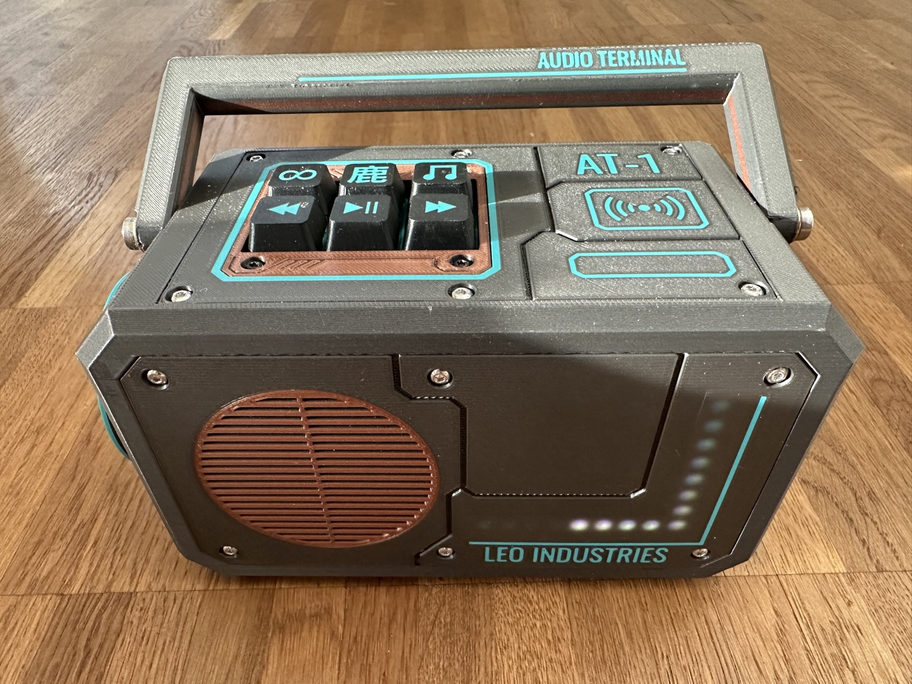

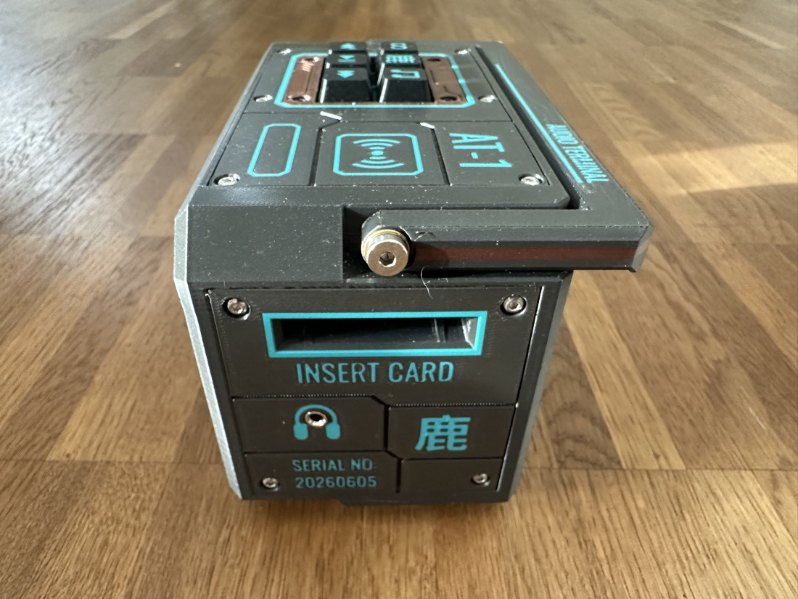

<sub>The finished, 3D-printed AT-1 — front panel with the play controls and speaker, and the RFID “INSERT CARD” cartridge slot.</sub>

</div>

## Bill of materials

| Part | Details | Source |
| --- | --- | --- |
| Mainboard | ESPuino **complete** board (rev 5.1) | [forum.espuino.de](https://forum.espuino.de/t/espuino-complete/3817) |
| Headphone amplifier board | biologist79 **MS6324 + TDA1308 / LM4808M** board | [forum.espuino.de](https://forum.espuino.de/t/kopfhoererplatine-basierend-auf-ms6324-und-tda1308-bzw-lm4808m/1099) |
| Rotary-encoder board | **Drehencoder by ESPuino** | [forum.espuino.de](https://forum.espuino.de/t/drehencoder-by-espuino/2414) |
| RFID reader | NXP **PN5180** (JST 2.5 mm socket soldered on) | [AliExpress](https://de.aliexpress.com/item/1005006781712003.html) |
| RFID tags | one tag per cartridge | [Amazon](https://www.amazon.de/dp/B0CSJST6KZ) |
| Display | **OLED** 128×64, I2C (SH1106 / SSD1306) | [AliExpress](https://www.aliexpress.com/item/1005006862867338.html) |
| Speaker | **Peerless by Tymphany TC7FD00-04** | [SoundImports](https://www.soundimports.eu/de/peerless-by-tymphany-tc7fd00-04.html) |
| Battery | **LiFePO₄ 3.2 V 6000 mAh** pack with protection, JST-PH 2.0 | [eremit.de](https://www.eremit.de/p/3-2v-6000mah-pack-mit-schutz-arduino-aio-jst-ph-2-0-stecker) |
| Status LEDs | 2× **8-LED WS2812B** (NeoPixel) | [Amazon](https://www.amazon.de/dp/B09YTLY6CK) |
| Standby LED | **white breathing LED** | [AliExpress](https://de.aliexpress.com/item/1005005336879647.html) |
| Internal USB tap | adapter to tap USB off the complete board (**4-pin version**) | [AliExpress](https://de.aliexpress.com/item/1005009847773743.html) |
| External USB port | panel-mount socket that exposes an external USB port and passes the 4 USB lines through to the internal connector | [AliExpress](https://de.aliexpress.com/item/1005009015653966.html) |
| Power switch | latching switch | [AliExpress](https://de.aliexpress.com/item/4001099324784.html) |
| Key switches | **Kailh BOX Navy** (clicky) for the panel buttons | [whackydesks](https://whackydesks.com/produkt/kailh-box-navy/) |
| Magnets | 4× **10×3 mm** per cartridge | — |
| Screws | 50× button-head **ISO 7380 A2 M3×8**<br>25× thermoplastic self-tapping **2.5×10 TORX, black A2** | [screwsandmore](https://www.screwsandmore.de) |
| Sealing | Kafuter **K-704B** + **K-705**, transparent | — |

### Filament & finishing

- **[Extrudr XPETG Matt](https://www.extrudr.com/shop-eu/products/xpetg-matt/)** — Metallic and Black
- **[Extrudr PETG](https://www.extrudr.com/shop-eu/products/petg/)** — Turquoise and Copper
- **[Bambu Lab TPU 85A](https://us.store.bambulab.com/products/tpu-85a-tpu-90a)** — for the gaskets

Many of the JST/connector cables were hand-crimped with **ENGINEER PA-09** crimping pliers.

> 🚧 _Still to add: photos of the opened unit / internals and wiring/pinout notes._

---

# // SOFTWARE

The firmware is based on ESPuino's `dev` branch with a cyberpunk web interface and a set of
fork-specific features. The full interface (default RFID tab shown below, live from the device):

<div align="center">

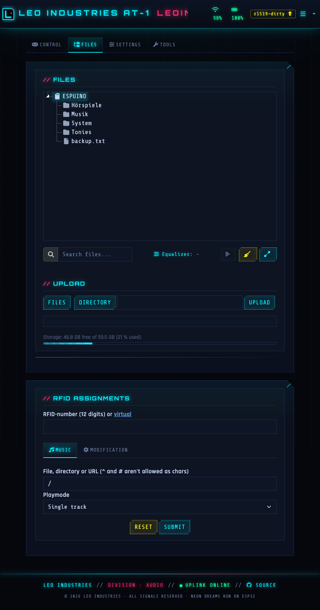

</div>

## // Differences to upstream

All changes compared to upstream/`dev`, each with a reference to its commit.

### Web interface

The management and access point pages were completely rebuilt in a cyberpunk style — neon
palette, scanlines, `Orbitron`/`Rajdhani`/`Share Tech Mono` typography, a custom login page, the
upstream Bluetooth scan UI restyled to match, the device branding in the navbar and an embedded
neon logo that doubles as the SVG favicon ([`7be5254`](../../commit/7be5254)):

<div align="center"></div>

| Change | Commit |
| --- | --- |
| **Cyberpunk web interface**: the management + access-point pages rebuilt with a neon palette, scanlines, `Orbitron`/`Rajdhani`/`Share Tech Mono` type, a custom login page, navbar branding, an SVG-favicon logo and a matching footer; the upstream Bluetooth scan UI restyled to fit | [`7be5254`](../../commit/7be5254) · [`b49f131`](../../commit/b49f131) |
| **Selectable UI themes** (menu → 🎨): switch the whole interface between the default **Cyberpunk** look and two bright, rounded, playful alternatives — **Candy** (pink/purple) and **Galaxy** (blue/indigo). Themes are a pure client-side CSS-variable swap (zero extra load on the ESP32 — the device still serves one static page) and the choice is remembered per browser in `localStorage` | [`6bb0097`](../../commit/6bb0097) · [`32a4d9b`](../../commit/32a4d9b) |
| **Fully offline web interface**: all third-party libs + fonts are vendored and served gzipped from flash (one JS + one CSS bundle), so the UI loads fast and works without internet (incl. AP mode) — fixes the ~2-min first-load hang and the browser stalls caused by too many parallel requests to the ESP32 | [`c618191`](../../commit/c618191) |
| **PWA**: installable web-app manifest + icon ("add to home screen"), plus an offline fallback page with auto-reconnect when launched while the player is powered off | [`b4287b9`](../../commit/b4287b9) · [`bd07a7c`](../../commit/bd07a7c) |
| **Consolidated, auto-saving Settings tab**: WiFi/MQTT/FTP/Bluetooth merged with the general settings into one tab; the sub-tabs are a **vertical UniFi-style sidebar** (icon-only on mobile; stays pinned while scrolling) with flat, consistent sections, split into General / **Buttons** / **LEDs** / **Power** / **RFID** / … . General/Buttons/LEDs/Power/RFID auto-save (debounced); the credential tabs keep an explicit submit on purpose | [`8b01876`](../../commit/8b01876) · [`1944cf4`](../../commit/1944cf4) · [`c284d0e`](../../commit/c284d0e) · [`32aabfd`](../../commit/32aabfd) |
| **Configurable branding**: re-brand the navbar header + footer (General → Branding) with a live preview as you type — empty keeps the "Leo Industries" default, so the fork is easy to re-brand | [`fd57fcb`](../../commit/fd57fcb) |
| **Password protection**: single password (no username), 90-day session cookie, brute-force lockout, logout entry; off in hotspot mode. Scripts/API clients authenticate with the password as an **API key** (`X-API-Key` header / `apikey` query param) | [`e74e712`](../../commit/e74e712) |
| **One shared device password (Security tab)**: the password fields were pulled out of the WiFi/FTP/WebDAV tabs into a single **Security** sub-tab — one password now protects the web interface, FTP *and* WebDAV (set once, applies everywhere; applied live without a reboot). An **empty password is accepted** and disables protection for all three. The **hostname** moved to the top of the **General** tab (saved on its own; `/wificonfig` now does partial updates) and the navbar brand reads just **Leo Industries** | [`PENDINGHASH2`](../../commit/PENDINGHASH2) |
| **One-click OTA + version badge**: a Tools-tab button (also bindable command **186** / MQTT `firmware_update`) pulls the rolling `latest` GitHub release and flashes it over OTA; a navbar badge shows the running build and turns amber when an update is available (passive `/version` check) — click it to install | [`8527f5e`](../../commit/8527f5e) · [`b736abc`](../../commit/b736abc) |
| **HTTP file sync**: pull audio files from a web server onto the SD card from a JSON manifest — additive, streamed in chunks straight to SD, background task with live progress + stop, abort-on-button, stall watchdog, auto-pauses playback and keeps the device awake mid-transfer. The manifest is streamed into the parser to halve peak RAM | [`ac24bbc`](../../commit/ac24bbc) · [`42d2c46`](../../commit/42d2c46) |
| **WebDAV server**: mount the SD card as a network drive (`http://<ip>:81/`) to copy audio on/off it straight from Finder/Explorer — no FTP client needed. Self-contained server (OPTIONS/PROPFIND/GET/HEAD+ranges/PUT/DELETE/MKCOL/MOVE/COPY/LOCK) running in its own task pinned to core 0 so transfers never disturb the audio pipeline; optional HTTP-Basic credentials. Configure + auto-start on boot in its own **WebDAV** settings sub-tab; start/stop live from the Control tab, command **188** or MQTT `webdav` (Home Assistant switch included). With auto-start on, the share is announced over **Bonjour/mDNS** (`_webdav._tcp`, `path=/`) so it pops up by itself in the Finder/Explorer network sidebar — no manual "Connect to Server" needed (currently disabled — see `WEBDAV_ENABLE`) | [`9b2bee0`](../../commit/9b2bee0) |
| **RFID-tag syncing (central server + peer-to-peer)**: keep tag assignments in sync across a PHP server *and* other ESPuinos — newest-wins by timestamp, deletions propagate via tombstones, automatic catch-up after coming online so a player used offline/outdoors keeps working. Run from the Tools tab, command **187** or MQTT `rfid_sync` | [`99ffb5b`](../../commit/99ffb5b) |
| **Equalizer profiles**: Flat / Music / Audiobook-Speech / Deep-voices / Custom presets on the 3-band tone control (speech presets keep deep narrator voices intelligible); assignable per file/folder, cycle via command **154** / MQTT `equalizer`. An over-full per-path rule set is now rejected with a clear error instead of silently failing | [`11ade33`](../../commit/11ade33) · [`addff5c`](../../commit/addff5c) |
| **Audiobook resume hardening**: the play-position is checkpointed to flash every ~30 s while playing, so a dead-battery / hard power-off only loses a few seconds instead of the whole track; the learned-cards list shows each tag's resume point with a restart-from-start button | [`a9f498f`](../../commit/a9f498f) |
| **M3U playlist builder**: a two-pane, drag-to-reorder builder (SD files, whole folders, webradio URLs) writes `/Playlists/<name>.m3u`; assign it to a card with play mode 11 | [`af041fc`](../../commit/af041fc) |
| **Learn RFID cards from the file browser**: right-click a file/folder → pick a play mode → scan popup; tree rows are badged when they have an RFID assignment or per-path EQ rule. When a card is **already assigned**, the same context menu lets you **switch its play mode in place** (e.g. single track → audiobook) without laying the card on the reader again — the current mode is ticked, and *Learn another card* keeps the scan flow available. A dedicated **RFID** settings sub-tab learns **modification cards**, lists all learned cards, and holds the reader settings (type, gain, LPCD, SLIX2 password) | [`7b8e303`](../../commit/7b8e303) · [`03c7b5a`](../../commit/03c7b5a) |
| **Now-playing metadata**: parses ID3 title/artist/album + embedded cover (with a folder `cover.jpg`/`folder.jpg` fallback); an info dialog shows the full detail (codec / sample-rate / bitrate / channels, path, play mode, RFID tag) via `GET /currenttrack`; artist/album are also published to MQTT + Home Assistant | [`ce3116c`](../../commit/ce3116c) · [`fda14a3`](../../commit/fda14a3) · [`4123db6`](../../commit/4123db6) · [`5cb0b8b`](../../commit/5cb0b8b) |
| **Listening statistics**: per-day listening time (today / yesterday / 7 d / 30 d) in a 365-day NVS ring buffer, plus a most-played-cards top list — shown in the info dialog (`GET /info`, `GET /topcards`). The info dialog also draws a **30-day bar chart** (inline SVG, themed, no chart lib) and offers a **CSV export** of the full daily series (`GET /stats.csv`, `date,seconds`) | [`af6c8d3`](../../commit/af6c8d3) · [`c2e7d44`](../../commit/c2e7d44) |
| **Full backup**: export/import all settings + RFID assignments + per-path EQ rules + listening stats as one JSON file; passwords are only included when explicitly ticked, so a shared backup doesn't leak credentials | [`4c90ff4`](../../commit/4c90ff4) · [`646ec5c`](../../commit/646ec5c) |
| **Home Assistant MQTT discovery**: auto-registers all entities under one HA device — track/status/firmware/WiFi/battery sensors, volume & LED-brightness numbers, lock & ambient-light switches, equalizer select, transport/update/shutdown buttons | [`db73db1`](../../commit/db73db1) |
| **Apple HomeKit + Siri** (`HOMEKIT_ENABLE`, via [HomeSpan](https://github.com/HomeSpan/HomeSpan)): pair the player straight into the Home app as a bridge with named tiles — **Playback** (play/pause + battery), **Volume** (brightness dimmer) and **Button-lock** — all controllable by Siri and usable in automations. State is mirrored back, so changes from buttons/RFID show up on the iPhone. Each device generates its **own random pairing code** on first boot (persisted in NVS) instead of a shared hard-coded one, so multiple ESPuinos — and everyone running this firmware — stay distinct and private. A dedicated **HomeKit settings section** shows the scannable pairing **QR code** + that setup code and a "reset pairing" button. Pairs over the existing WiFi (no MFi chip needed); the HAP server runs on its own port and the poll task is pinned to core 0 so it never disturbs the audio pipeline on core 1 | [`6387563`](../../commit/6387563) |
| **Control tab**: Repeat / Sleep-Timer (live countdown) / Night-Mode / button-lock / FTP start-stop and a Bluetooth-mode picker (Normal / Speaker / Headphones) right in the control tab; mobile-optimised (full-width louder/quieter buttons instead of the fiddly slider) | [`88a742c`](../../commit/88a742c) · [`520815a`](../../commit/520815a) · [`d57f24a`](../../commit/d57f24a) · [`aef1765`](../../commit/aef1765) |
| **Battery-backed RTC (DS3231)**: optional real-time clock on the external I²C bus so the time stays correct without WiFi/NTP (seeds the clock at boot, NTP disciplines it); time + die-temperature in the info dialog and via MQTT/HA | [`bf90f66`](../../commit/bf90f66) |
| **State-driven control LEDs**: the optional control LEDs can mirror a runtime state (key-lock / repeat mode / Bluetooth / battery level) instead of a static colour, per-slot configurable, with a master mute (command **121** / MQTT `control_leds`) | [`d12a496`](../../commit/d12a496) |
| **Navbar status indicators**: battery level + low-battery warning, WiFi signal strength (RSSI %), and small blinking OK / connection-lost icons that replace the old pop-up toasts | [`4566ae0`](../../commit/4566ae0) · [`26e8cf8`](../../commit/26e8cf8) · [`f41bb72`](../../commit/f41bb72) · [`be13308`](../../commit/be13308) |
| **File browser touches**: renamed "Files" with a taller tree, drag-&-drop upload, an SD-capacity gauge, and one-click SD cleanup of macOS metadata (`.DS_Store` / `._*` / Spotlight) | [`3af1fc2`](../../commit/3af1fc2) · [`f8b477b`](../../commit/f8b477b) · [`45b340a`](../../commit/45b340a) · [`4e68541`](../../commit/4e68541) |
| **No standby on external power**: optional setting that suppresses the inactivity standby while on external power (inferred from battery voltage on the `complete` board, which has no USB-sense) | [`0863f75`](../../commit/0863f75) |
| Smaller touches: live-refreshing log dialog + text download, the system-info dialog as a property table (incl. the PN5180 reader firmware version), FTP stop button + password reveal, play/pause from the RFID tab, and an updated OpenAPI/Swagger spec at `/swagger.html` | [`5183e78`](../../commit/5183e78) · [`715d867`](../../commit/715d867) · [`6ea4020`](../../commit/6ea4020) · [`df0a583`](../../commit/df0a583) · [`3870bb7`](../../commit/3870bb7) · [`f8298d9`](../../commit/f8298d9) |

#### Feature highlights

**SD capacity gauge** — free / total space below the file browser ([`45b340a`](../../commit/45b340a)):

<div align="center">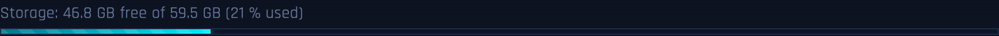</div>

**Battery indicator** — live charge level in the navbar ([`4566ae0`](../../commit/4566ae0)):

<div align="center">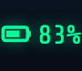</div>

**SD cleanup** — one click removes macOS metadata junk ([`4e68541`](../../commit/4e68541)):

<div align="center"></div>

**SLIX2 password** — read protected ICODE-SLIX2 tags ([`d3cc69c`](../../commit/d3cc69c)):

<div align="center">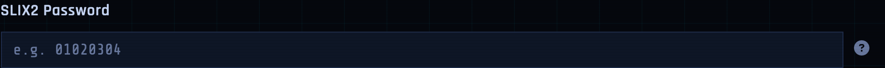</div>

**Equalizer presets** — Flat / Music / Audiobook-Speech / Deep voices / Custom on top of a 3-band tone control ([`11ade33`](../../commit/11ade33)):

<div align="center">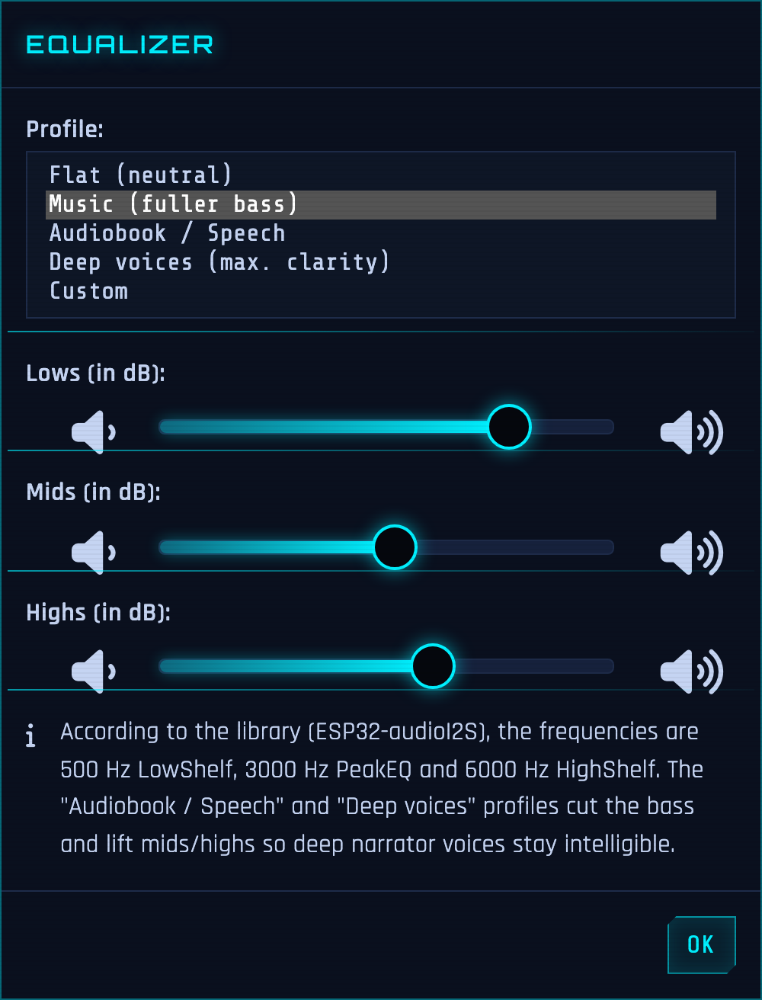</div>

**Control buttons** — single-track Repeat, Sleep-Timer, Night Mode, FTP, Bluetooth and lock, directly in the control tab ([`88a742c`](../../commit/88a742c)):

<div align="center"></div>

**Bluetooth-mode dropdown** — switch Normal / Speaker / Headphones from the control tab (the active mode is hidden) ([`d57f24a`](../../commit/d57f24a)):

<div align="center">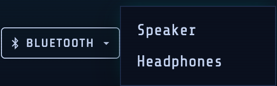</div>

**Apple HomeKit** — pair the player into the Home app straight from the settings: a scannable QR code + the per-device setup code, configurable device/remote names, and regenerate-code / reset-pairing buttons (codes below are placeholders) ([`6387563`](../../commit/6387563)):

<div align="center">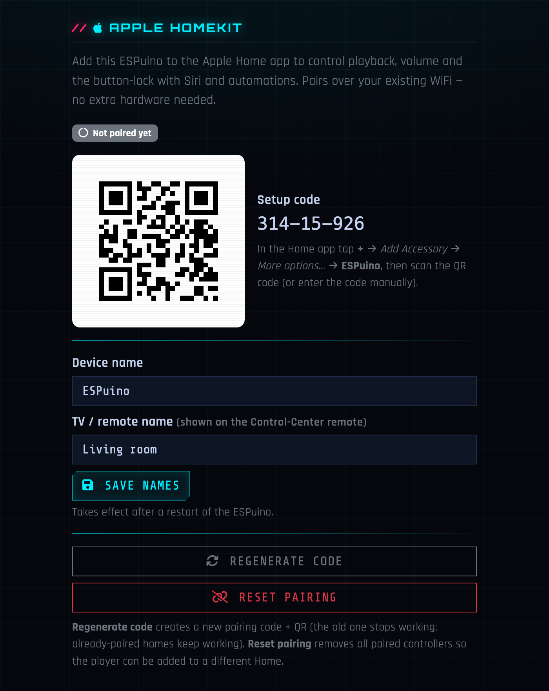</div>

**Settings tab** — WiFi / MQTT / FTP / Bluetooth merged with the general settings into one tab, laid out as a vertical UniFi-style sidebar with flat, consistent sections ([`8b01876`](../../commit/8b01876), [`32aabfd`](../../commit/32aabfd)):

<div align="center">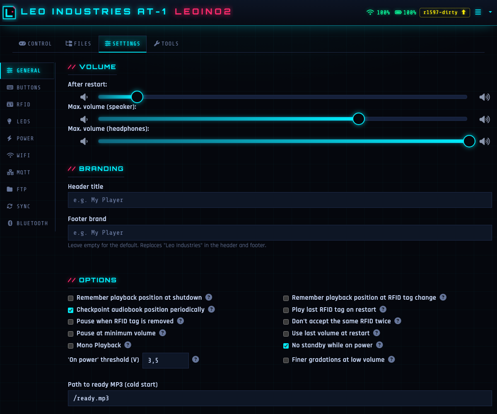</div>

**Buttons sub-tab** — short/long press and multi-button command assignments in their own settings sub-tab ([`8b01876`](../../commit/8b01876)):

<div align="center">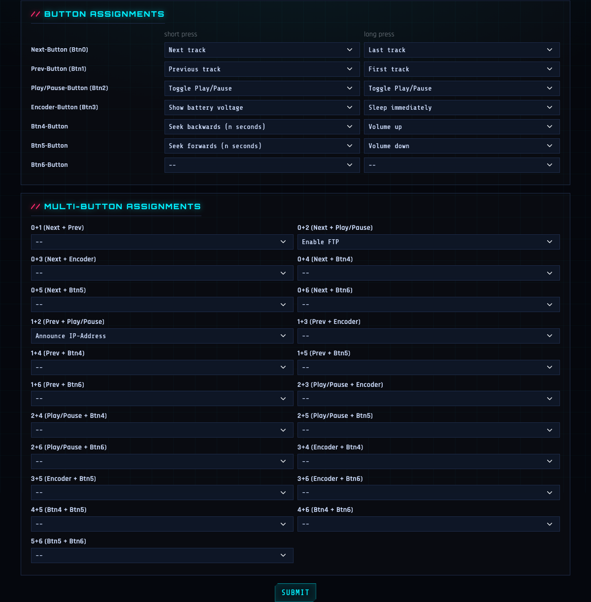</div>

**Playlist builder** — assemble an `.m3u` from SD files, whole folders and webradio URLs in a drag-to-reorder two-pane dialog ([`af041fc`](../../commit/af041fc)):

<div align="center">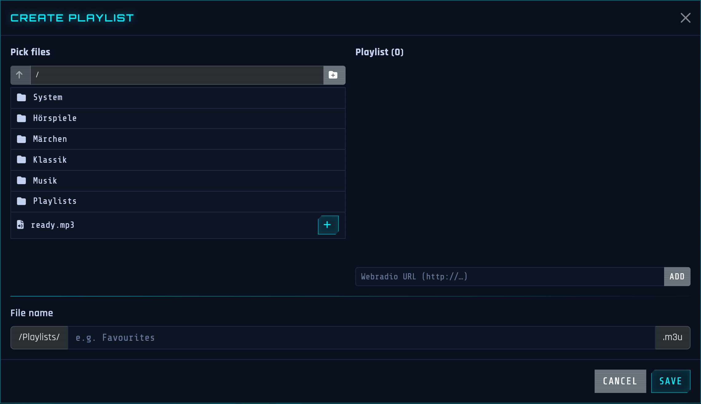</div>

**Sync settings tab** — pull files from a web server (manifest URL + optional Basic Auth) *and* keep RFID-tag assignments in sync across a central PHP server and other ESPuinos (P2P, newest-wins with offline catch-up); both runners live in the Tools tab ([`ac24bbc`](../../commit/ac24bbc), [`99ffb5b`](../../commit/99ffb5b)):

<div align="center">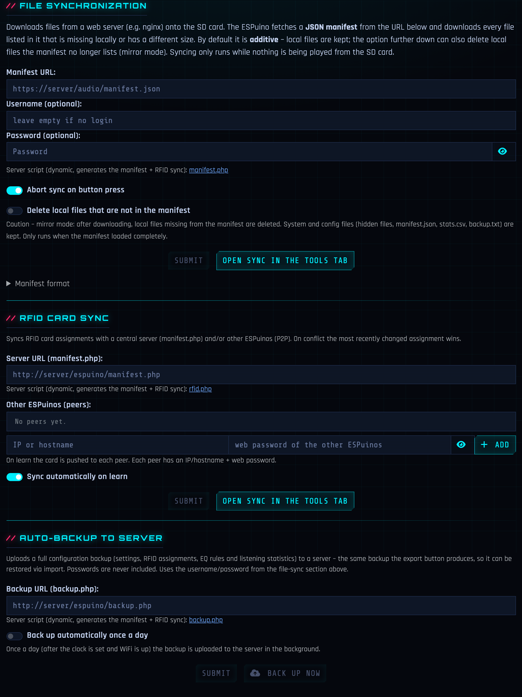</div>

**Learn RFID cards from the file browser** — right-click a file/folder → pick a play mode → a popup asks you to lay the card ([`7b8e303`](../../commit/7b8e303)):

<div align="center">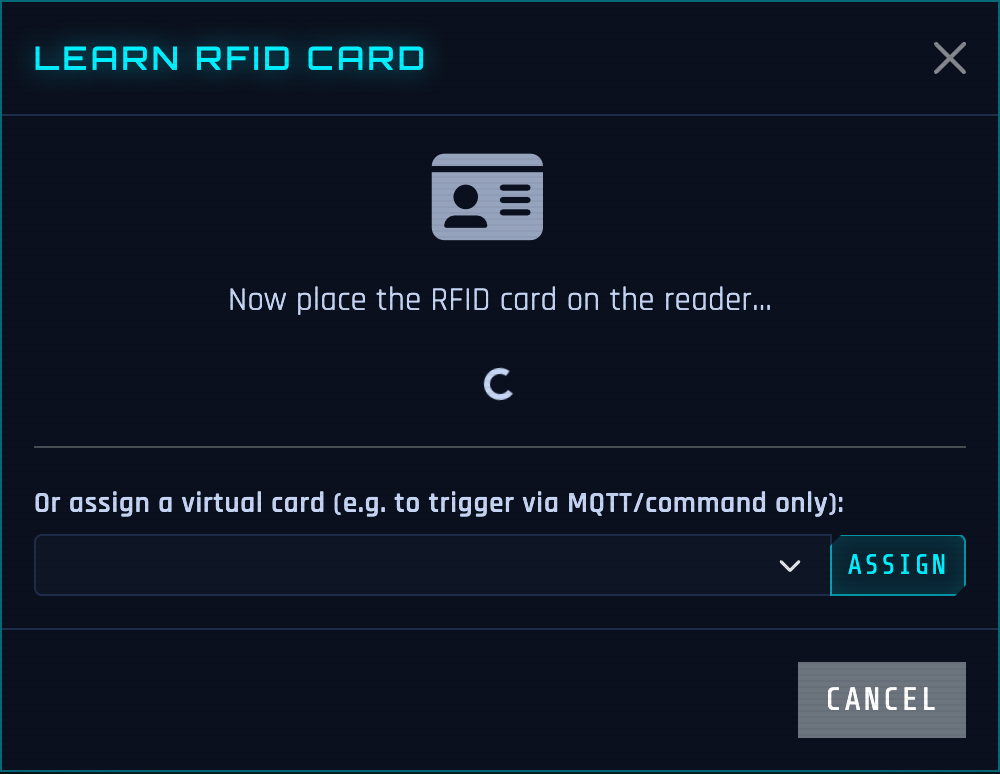</div>

**Listening-time statistics** — today / yesterday / last 7 / last 30 days in the info dialog ([`af6c8d3`](../../commit/af6c8d3)):

<div align="center">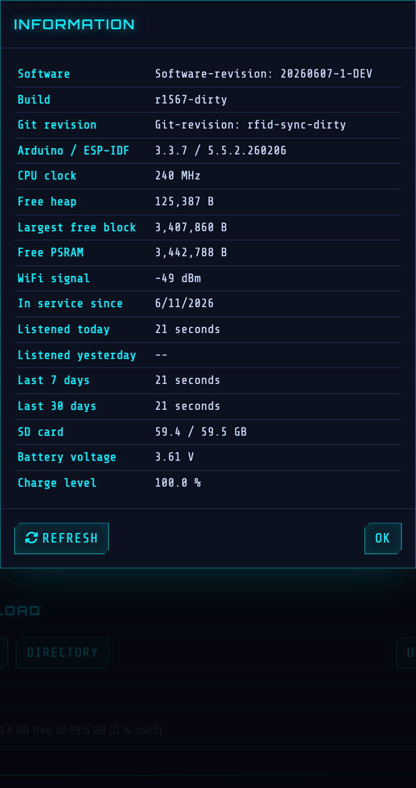</div>

**Configurable branding** — re-brand the header and footer; empty keeps the default ([`fd57fcb`](../../commit/fd57fcb)):

<div align="center">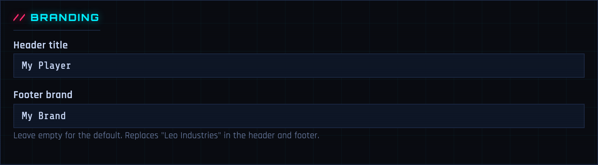</div>

### RFID & audio

| Change | Commit |
| --- | --- |
| Tag removal detected via consecutive-miss counter instead of a wall-clock timeout: pause after ~0.5 s, immune to phantom dropouts and task starvation | [`1fad9cd`](../../commit/1fad9cd) |
| Vendored PN5180 library with fast no-card detection: read attempts on an empty field take ~25 ms instead of ~230 ms (no more 200 ms timeout) | [`8762784`](../../commit/8762784) |
| SLIX2 password support for protected ICODE-SLIX2 tags | [`d3cc69c`](../../commit/d3cc69c) |
| Configurable idle LED and progress bar colors | [`bdc54e5`](../../commit/bdc54e5) |
| Ready sound on cold start | [`c051c40`](../../commit/c051c40) |
| Cyberpunk "Data Drop" idle LED animation | [`f20b111`](../../commit/f20b111) |
| Selectable idle animation (standard idle dots or cyberpunk "Data Drop") in the LED settings; defaults to standard | [`f6c3f4e`](../../commit/f6c3f4e) |
| Improved button responsiveness and track navigation seek options | [`76e1535`](../../commit/76e1535) |
| Unlocking controls via button press while locked | [`d83e15f`](../../commit/d83e15f) |
| Support for a 6th button | [`b116151`](../../commit/b116151) |
| OLED display support (SH1106/SSD1306 128×64 over I2C): boot splash, idle screen with IP + READY, now-playing title (up to 3 lines, scrolling) with battery/time/wifi status bar, and a volume bar | [`8ce8104`](../../commit/8ce8104) |
| Audiobook resume fade-in: continuing a saved position briefly stutters in the first ~2 s (file open + MP3 header decode + seek-flush saturate the 1-bit SD/CPU while I2S already plays). The resume now rewinds a few seconds and fades the volume up over that span, so the glitch lands on already-heard audio — no content lost, clean sound from where you stopped. Tunable / disable via `RESUME_FADEIN_DURATION_MS` and `RESUME_FADEIN_REWIND_S` in `settings.h` | [`583225f`](../../commit/583225f) |

### Virtual RFID cards

This is an existing ESPuino feature (not a fork addition) that is easy to miss, so it is documented
here for clarity. Action-to-button assignment in general works as described in the upstream
*"dynamic button layout"* documentation.

**Normal card.** A physical RFID card has a fixed, pre-programmed number. When the card is placed on
the reader the ESP32 reads that number (it is also pushed into the web interface). You then *learn*
the card — i.e. you link its number to an action. The next time the card is placed, the ESP32 looks
up that mapping in its flash and runs the matching action.

**Virtual card.** You bind a button press (short or long) or a two-button combination to an action
in `settings.h` as usual — but the actions `CMD_VIRTUAL_RFID_CARD_01` … `CMD_VIRTUAL_RFID_CARD_10`
are special: they *simulate placing a card*. Running `CMD_VIRTUAL_RFID_CARD_01` is exactly the same
as placing a physical card with the number `900000000001` (…`_10` → `900000000010`). You learn that
number in the web interface like any normal card, and pressing the bound button then has the same
effect as placing that card. The fixed ids live in [`src/values.h`](src/values.h) and are enqueued
in [`src/Cmd.cpp`](src/Cmd.cpp). MQTT can lay the same ids via the `rfid` command topic.

> Tip: to learn a (physical or virtual) card to a file/folder, right-click it in the file browser →
> **RFID anlernen** → pick a play mode, then lay the card (or press the button bound to its virtual id).

## // Flashing

```bash
pio run -e complete -t upload
```

The web interface (HTML, locales, manifest, icons) is embedded into the firmware automatically
during the build. Alternatively use OTA: Tools → firmware update with
`.pio/build/complete/firmware.bin`.

This fork is developed and shipped on the **complete** board, but the upstream ESPuino board
environments are kept in `platformio.ini` for anyone running different hardware:
`lolin_d32_pro`, `lolin_d32_pro_sdmmc_pe`, `ttgo_t8`, `esp32-wrover-devkitc-v4-8mb` and
`esp32-s3-devkitc-1` (e.g. `pio run -e ttgo_t8 -t upload`). Only `complete` is built in CI.

## // Upstream sync

The fork follows upstream/`dev`. The remote is already set up:

```bash
git fetch upstream
git rebase upstream/dev
```

## // License

Same as the original: [GPL-3.0](LICENSE). The original README content (hardware, HALs, wiring)
can be found in the [ESPuino documentation](https://github.com/biologist79/ESPuino#readme).
